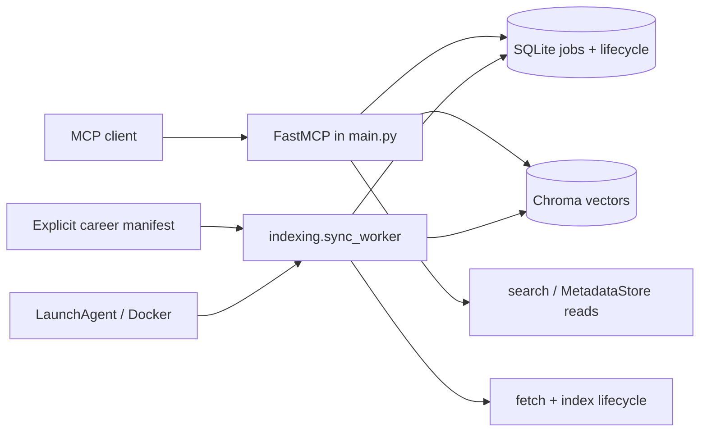
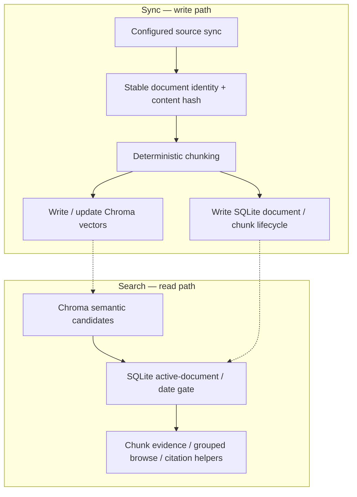
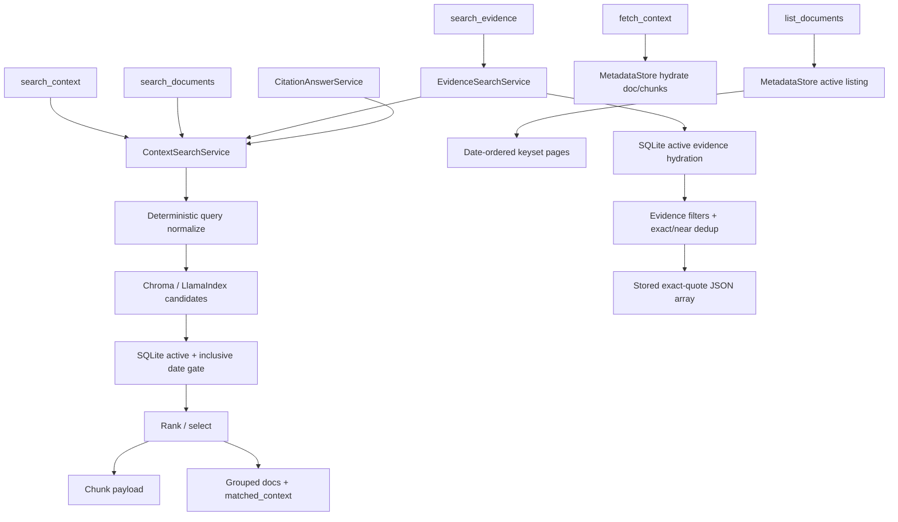

# Architecture

## Runtime Structure



Two processes share one SQLite DB and one Chroma store:

| Node | Meaning |
| --- | --- |
| MCP client → FastMCP | Claude/Cursor/Application OS calls MCP tools (`sync_*`, `search_*`, …) over stdio |
| LaunchAgent / Docker → Worker | Supervises one `indexing.sync_worker` process per store so sync keeps running after the MCP client stops |
| SQLite jobs + lifecycle | Same `MetadataStore`: job queue (enqueue/claim/status) **and** document/chunk/tombstone lifecycle |
| search / MetadataStore reads | FastMCP read path: active-gate search, `list_documents`, `fetch_context`, status |
| fetch + index lifecycle | Worker write path: overlapping connector fetch for up to `N` distinct-source jobs → chunk → Chroma write under in-process mutation lock → SQLite lifecycle → terminal job status |
| Chroma vectors | Semantic candidate store only; SQLite decides what is still active/citeable |

### Workflow

1. Client asks FastMCP to sync → FastMCP **enqueues** (or reuses) a job in SQLite and returns.
2. Worker **claims** queued jobs while `COUNT(RUNNING) < N`, runs fetch + index (fetch may overlap; Chroma mutations serialize in-process), writes Chroma + SQLite lifecycle, marks each job succeeded/failed.
3. Client asks FastMCP to search → FastMCP pulls Chroma candidates, applies the **active gate**, returns evidence.
4. Client can **status**-poll the exact job with `get_sync_status(source_id, job_id)`.

LaunchAgent/Docker only keep the worker process alive. They are not the queue;
SQLite is. The supported ops model is **one** LaunchAgent (or equivalent)
`sync_worker` process against a given Chroma/SQLite store — extra worker PIDs
can oversubscribe Chroma writes even when each process respects `N`.
Operators must restart both processes after `.env` or source-target
changes: restart FastMCP **and** the worker (LaunchAgent restart script, or
Docker recreate with the same `docker run ... --env-file` — `docker restart`
keeps the old env).

### Job queue: enqueue / claim / status

| Term | Who | Meaning |
| --- | --- | --- |
| **enqueue** | FastMCP (`sync_source` / `sync_all`) | Insert a new sync job as `queued`, or return the existing queued/running job for that source (no duplicate). Returns immediately — does not wait for fetch/index. |
| **claim** | Worker | Atomically take the next `queued` job → `running` while `COUNT(RUNNING) < N`, attach owner/pid/heartbeat, then execute fetch + index. Up to `N` distinct-source jobs may run concurrently in one worker. |
| **status** | FastMCP (`get_sync_status`) | Read the job (or source's latest job) from SQLite: `queued` / `running` / `succeeded` / `failed`. Exact-job mode uses both `source_id` and `job_id`. |

### Document / chunk / tombstone lifecycle

SQLite tracks what content exists and whether it may be cited — separate from Chroma vectors:

| Unit | Role |
| --- | --- |
| **document** | One synced page/note/file (identity, timestamps, active vs deleted). Sync unit. |
| **chunk** | Search/citation unit carved from a document (text + citation metadata). |
| **tombstone** | Soft-delete marker (`deleted_at`, …) for content that disappeared from a **complete successful** cleanup-capable sync. Stale Chroma hits for tombstoned docs must not be returned as evidence. Failed/partial syncs must not tombstone absences. |

### Active-gate search

Chroma only proposes semantic **candidates**. Before results go to the client, SQLite checks each hit is still an **active** (non-tombstoned) document/chunk and passes date/source filters. That check is the **active gate**. Without it, search could cite deleted or out-of-range content just because an old vector still exists.

## Module Map

| Module | Owns |
| --- | --- |
| `api/` | MCP tool contracts, formatting, caller-visible errors |
| `fetching/` | Notion, Tistory, GitHub, Obsidian, and explicit-manifest career connectors |
| `parsing/` | Root-bounded PDF, DOCX, Markdown, and text career parsing |
| `indexing/` | Worker claim/dispatch under bounded global RUNNING budget, chunking, in-process Chroma mutation lock, sync lifecycle |
| `search/` | Retrieval, ranking, SQLite active gates, CitationAnswerService, extractive EvidenceSearchService |
| `storage/` | SQLite source/job/document/chunk/tombstone metadata |
| `core/` | Shared models, exceptions, utilities |
| `environments/` | AppConfig, Chroma setup, token/env access |
| `evaluation/` | Offline deterministic candidate provider routed through real ContextSearchService + EvidenceSearchService for selected CI evaluation, plus dataset validation, metrics/reports, proxy experiment configs, measured fixture baseline, and thresholds |
| `main.py` | FastMCP composition/startup only |
| `deploy/launchd`, `scripts/` | macOS supervision helpers (not ingestion/persistence) |

New behavior starts in the owning module; avoid cross-module shortcuts in
`api/tools.py` when a service boundary fits.

## Core Mental Model

End-to-end data path: **sync writes** into stores, then **search reads** through
the active gate. Chroma sits in the middle.



## Sync / Job Ownership

```mermaid
sequenceDiagram
  participant MCP as FastMCP / sync_* tools
  participant Q as SQLite job queue
  participant W as sync_worker
  participant S as Connectors + indexer

  MCP->>Q: enqueue or reuse active job
  Note over Q: Queued jobs are unowned
  W->>Q: claim while COUNT(RUNNING) < N
  Q-->>W: running + owner/pid/heartbeat
  W->>S: up to N concurrent distinct-source syncs
  Note over W,S: Fetch may overlap; ContentIndexer mutation lock serializes Chroma writes in-process
  S->>Q: documents/chunks + terminal status
  Note over S,Q: Soft-delete missing docs only after a full successful sync on cleanup-capable sources
  MCP->>Q: get_sync_status(source_id, job_id) exact job
```

### Bounded concurrency

The generic worker may run up to `N` distinct-source jobs concurrently across
Notion, Tistory, GitHub, and Obsidian. Default `N` is 2 via
`CONTEXTWIKI_SYNC_WORKER_MAX_CONCURRENT` (integer `1..8`, fail-closed at
startup). `N=1` restores the previous global single-flight behavior. SQLite
claim remains authoritative with a `COUNT(RUNNING) < N` gate, and enqueue still
allows at most one active queued/running job per `source_id`. Within one
worker process, connector fetch may overlap while `ContentIndexer`'s
in-process mutation lock serializes Chroma mutations. That lock is not
cross-process: multiple worker PIDs against the same store can oversubscribe
writes even when each process respects `N`. Detail: ADR 0010.

### Ownership & recovery

- Queued jobs stay pending when no worker is available; do not fail them for
  lack of a running owner.
- Running jobs carry owner/heartbeat; same-source sync is blocked while queued
  or live-owned.
- Recovery: stale jobs, unowned grace, dead owners; **PID-reuse caution**
  (especially Docker PID 1). Process-start identity (Linux `linux-v2` /
  Darwin) is definitive only in-scope; unknown/malformed/cross-namespace falls
  back to heartbeat staleness.
- MCP shutdown does not cancel worker jobs. Graceful worker signal → fail
  **all** in-flight claimed jobs **without** tombstones. Abrupt death → orphan
  recovery marks failed; v1 does not auto-resume partial work. After the
  orphaned job is terminal `failed`, callers enqueue a **fresh** sync.

### Tombstone safety

Tombstones only after a **complete successful** cleanup-capable snapshot.
Failed, partial, or bound-truncated snapshots must not tombstone absences.

**cleanup-capable:** the source can prove a full remote/vault inventory for this
sync (Notion search, GitHub tree, Obsidian walk when bounds are not exceeded).
Tistory is not — its id-scan cannot prove “everything that exists” — so it never
tombstones absences.

### Job status (and optional phase)

- **`job.status`:** `queued` → `running` → `succeeded` | `failed` (what clients poll).
- **`phase`:** optional running-only progress hint (`starting`, `discovering_pages`,
  `fetching_page_content`, `indexing_documents`, …). Not a substitute for
  `status`. Detail / polling policy: ADR 0009.

### Running progress hints (`get_sync_status` only)

While a job is `running`, exact-job / latest-job payloads may also expose:

| Hint | Meaning |
| --- | --- |
| `upstream_total` | Source-neutral list/scan size so far (Notion pages, GitHub selected blobs, Obsidian notes, Tistory scan ids) |
| `upstream_done` | Items fetched, skipped, or otherwise completed so far |
| `last_progress_at` | Public liveness stamp for status polls (advances on coalesced progress writes) |
| `status_message` | Short sanitized, source-neutral text (e.g. “Fetching upstream items 25/100…”) |

```text
discovering_pages:     upstream_total = discovered so far; upstream_done = 0
fetching_page_content: upstream_total = final list/scan size; upstream_done = completed items
```

- Public MCP uses **only** `upstream_total` / `upstream_done`. Legacy SQLite
  columns `upstream_total_pages` / `upstream_fetched_pages` may be dual-written
  for older DBs but are **not** exposed. Reads prefer the new columns whenever
  they exist (including intentional `0`); one-time schema migrate backfills
  legacy → new.
- Hint writes are coalesced: full counter/`status_message` about every 25 items
  (and always on the last item); `last_progress_at` + heartbeat more often
  (~every 5) so polls do not look stuck and orphan detection stays fresh.
- Career parser cancellation remains in-memory at roughly 50 ms. Durable
  SQLite heartbeat/status polling is independently throttled to 0.5 seconds and
  blocking heartbeat writes run off the event loop, avoiding parser-duration
  write amplification and event-loop lock stalls.
- Connectors emit Notion-shaped progress events; ingestion maps them for all
  sources. Cooperative cancel: stop signal / `_InactiveJobStop` re-raises
  through emit helpers; Tistory cancels `create_task` fan-out in `finally`
  (including `CancelledError`); GitHub checks stop during owner-resolve
  pagination and between repo planning steps. Inactive-job stop must not be
  swallowed by stop-checker helpers.

Hints are suppressed again once the job is terminal. They do not widen
`sync_source` / `sync_all` response shapes.

### `sync_source` / `sync_all`

- `sync_source`: enqueue or reuse active job; return immediately (not wait for
  fetch/index). Disabled source → terminal `failed` in the same write.
- Worker claims work from SQLite (see Runtime Structure); MCP does not run
  long sync in-process when the worker is down.
- `sync_all`: launch acceptance only (`started` / `already_running` / `skipped` /
  `failed`). Completion = client polls exact
  `get_sync_status(source_id, job_id)` until terminal — not `latest_job`.
  Timing/backoff: ADR 0009.

## Retrieval



`search_evidence` is additive. `ContextSearchService` proposes ranked hybrid
candidates under one hard request budget of `3 * top_k` (maximum 150 for the
public `top_k <= 50` contract). That budget is shared across query variants;
bounded vector evidence retrieval disables metadata fallback so provider hits
plus fallback scan work cannot exceed it. This evidence path does not use the
general 64x refill expansion. Career vectors retain identity, the non-PII
`evidence_source_type` and `experience_type` taxonomies, and non-content chunk
lifecycle fields (position, line range, source/document version, and
created/updated timestamps); all retained metadata is excluded from embedding
serialization. Requested taxonomy and document-ID filters reach Chroma (or the
offline fixture provider) before the hard cap. SQLite remains authoritative for
all hydrated evidence metadata. Candidate chunk/document hydration then uses cached SQLite batches,
and `EvidenceSearchService` authoritatively reapplies the same filters against
active rows, preserves stored quote text and stable IDs, and removes exact and
token-Jaccard near duplicates. It does not call an LLM or synthesize evidence.
Standard logs use a request ID and query hash; they do not include full queries,
documents, or exact quotes.

Synchronous embedding, index construction, vector retrieval, ranking, candidate
hydration, and final authoritative evidence snapshot hydration execute in one
executor shared by each
`ContextSearchService`, not on the FastMCP event loop. The executor has the
same bounded concurrency as `AppConfig.connection_limit` (default `10`) and a
single total queue-plus-execution deadline from candidate retrieval through
final evidence hydration, using `AppConfig.request_timeout` (default `10`
seconds); embedded compositions can pass narrower constructor overrides.
Timeout or caller cancellation cannot stop an already-running Python thread,
so its concurrency slot remains reserved until the worker returns. This keeps
abandoned work bounded instead of starting replacement threads without limit.
`search_evidence` maps the deadline to the sanitized public error type
`timeout`; it never includes the query, document text, or provider detail.

## MCP Tool Contract

```text
list_sources() -> dict
sync_source(source_id: str) -> dict
sync_all() -> dict
get_sync_status(source_id: str = "", job_id: str = "") -> dict
search_context(query, filters=None, top_k=10, include_debug=False) -> dict
search_documents(query, filters=None, sort_by="relevance", sort_order="desc", top_k=10) -> dict
list_documents(filters=None, sort_by="indexed_at", sort_order="desc", page_size=20, cursor=None) -> dict
fetch_context(document_id="", chunk_id="") -> dict
search_evidence(query, source_types=None, experience_types=None, document_ids=None, top_k=5) -> JSON list[EvidenceChunk]
```

**Intent (short):**

- Filters: `source_id` / `source_ids` (union if both), inclusive UTC date bounds
  (`published_*`, `modified_*`, `indexed_*`); offset-free timestamps = UTC;
  date-only values start at midnight UTC; unknown fields rejected.
- `search_context`: chunk evidence; date gate in SQLite; optional `debug`
  (`{}` when `include_debug=False` except `no_matching_sources` exception).
- `search_documents`: same path, one row/doc, best chunk text as
  `matched_context` (not `preview`); optional date sort within semantic set.
- `list_documents`: no query; SQLite browse; `page_size` 1–50; opaque
  `next_cursor` must be reused unchanged with the same filters/sort; public
  rows expose only `document_id`, `source_id`, `title`, `url`, `canonical_url`,
  `platform`, `published_at`, `modified_at`, `indexed_at`, `date_provenance`
  — no content/local paths.
- Public search results expose normalized timestamps + `date_provenance` (not
  legacy `date` / `updated_at` reinterpretation).
- `auth_ref` only `env:UPPER_CASE_NAME`; other forms normalize to empty; public
  formatting rejects noncanonical refs.
- Status fields: `latest_success_at`, `latest_failure_at`, `document_count`,
  `chunk_count`, `latest_failure_reason`, `stale_cleanup_disabled_reason`.
- Tool annotations: retrieval tools are not read-only/idempotent (schema init /
  heartbeat); `search_*` `openWorldHint=True` (default embeddings may egress);
  `list_documents` / `fetch_context` `openWorldHint=False`.
- `search_evidence`: trimmed non-empty query; `top_k` 1–50 (default 5);
  optional fixed evidence-source, experience, and document-ID filters are
  combined. Success is one MCP text content block containing a bare JSON array;
  no match is `[]`. Invalid/internal failures are typed and sanitized.
- Keep names, params, return shapes, and error vocabulary stable unless the
  user requested a contract change; never leak secrets or full local paths.

## Identity & Chunking

| Source | Stable identity | Dates / version | Notes |
| --- | --- | --- | --- |
| Notion | page id | `published_at`/`modified_at`, `date_provenance="notion"` | Skip `fetch_block_content` when active stored doc has content and canonical `modified_at` matches page `last_edited_time` (or `created_time`); batched skip/reuse fields only; skipped pages still in snapshot for `last_seen` / cleanup |
| Tistory | `blog_name:post_id` | `published_at`, `date_provenance="tistory"` | No cheap remote change token before HTML body download (`published_at` only after fetch); fetch-before-index skip is intentionally out of scope |
| GitHub | repository path | blob SHA → `version_id` only (not a mod timestamp) | Skip `_fetch_blob_text` when active stored doc has content and `version_id` matches tree blob SHA; batched skip/reuse fields only; skipped blobs still in snapshot for `last_seen` / prefix cleanup |
| Obsidian | relative note path | mtime → `modified_at`, `date_provenance="filesystem"`; `obsidian://open` as citation URL | Skip note byte read when active stored doc has content and canonical `modified_at` matches filesystem mtime; batched skip/reuse fields include title and citation `line_start`; skipped notes still in snapshot for `last_seen` / cleanup; local vault Markdown, not a live Obsidian app |
| Career manifest | explicit `document_id` or normalized relative-path hash | SHA-256 content → `document_version_id`; filesystem created/modified stamps | Taxonomy changes do not change automatic identity; only listed PDF/DOCX/Markdown/text files inside a non-symlink root; explicit taxonomy is authoritative; complete successful manifest sync enables scoped tombstones |

Lifecycle fields: `external_id`, `document_id`, `canonical_url`, `version_id`,
`published_at`, `modified_at`, `indexed_at`, `date_provenance`, `last_seen_at`,
`last_seen_sync_id`, `deleted_at`.

Chunking: heading markdown → plain-text windows → line-range code chunks.
Citation metadata per chunk includes `chunk_id`, `document_id`, `source_id`,
`title`, `url`, `path`, `chunk_index`, `line_start`/`line_end`, hashes, version,
timestamps, `date_provenance`.

Plain-text and oversized Markdown section windows advance independent newline
cursors once, so citation line ranges are derived in `O(n)` rather than
rescanning each prefix for every chunk. Markdown detection and sectioning use a
`splitlines()`-compatible streaming iterator and flush completed sections
without retaining a second document-wide line/section list. An oversized
heading section is represented by one joined buffer and a monotonic window
cursor, so even a single-line section avoids repeated remaining-suffix copies
and remains linear. Parser title/section scans use the same streaming line
discipline and poll cancellation at most every 256 codepoints. DOCX uses
bounded 64 KiB reads with defused incremental XML parsing, polling every XML
event and at most every 64 text nodes. Chunk-model loops poll the cooperative
stop before every model build. Ingestion runs each document's CPU chunk
generation in a worker thread; cancellation sets the stop signal, joins that
worker before propagating cancellation, and therefore cannot leave an
unobserved chunking thread running against later sync lifecycle work.

Career document/chunk rows add `document_version_id`,
`evidence_source_type`, `experience_type`, `file_name`, `document_title`,
`section_title`, `parent_section_title`, `exact_quote`, `created_at`, and
available company/role/project/date metadata. Markdown and DOCX heading styles
feed section hierarchy. PDF/plain text hierarchy is best effort.
PDF subprocess deadline/cancellation polling remains fast, while Darwin RSS
sampling of the validated absolute `/bin/ps` helper is independently throttled
to 0.5 seconds to avoid spawning a monitor process on every poll.

### Career source boundary

`SourceType.CAREER` identifies the connector transport. It is separate from
the evidence taxonomy: `resume`, `previous_resume`, `project`,
`github_readme`, `behavioral_story`, `career_note`, and `skills_inventory`.
Experience is explicit: `professional`, `academic`, `personal_project`,
`prototype`, or `unknown`; prose never upgrades a personal project to
professional experience.

`source_career` is registered only when
`CONTEXTWIKI_CAREER_MANIFEST_PATH` is non-empty. A relative, missing, or
symlinked configured manifest leaves that registered source disabled with a
sanitized reason. A valid absolute manifest enables it. The manifest is an
authoritative complete snapshot only after every entry parses successfully;
failed/partial parsing disables stale cleanup.

Manifest parsing remains all-or-nothing for indexing. A typed failure carries
only bounded attempted/completed document counts and elapsed parsing time; the
terminal failed-job transaction records those as `total_documents`,
`parsed_documents`, and `parsing_failures=1`. Because indexing has not started,
`indexing_latency_ms` remains zero; parsing time is not mislabeled as indexing
time. It never persists partial documents or exposes a local path or document
content. A retry starts a fresh job and reprocesses the authoritative manifest
snapshot.

Manifest, root, nested listed-file directories, and listed files use
descriptor-relative `O_NOFOLLOW` traversal from `/`. Each opened component is
current-user- or root-owned and rejects group/world write access; the only
writable-directory exception is an exact standard root-owned sticky temp root.
The manifest is read through the validated descriptor while its parent
descriptor stays open; relative roots open from that same parent descriptor.
The parser duplicates the bound root descriptor, securely reopens and verifies
its device/inode before and after each listed-file read, and uses the bound
descriptor chain for the read. Intermediate symlink ancestors and root/parent
swaps therefore cannot redirect ingestion.
The complete manifest and every listed file also compare descriptor `fstat`
snapshots before and after reading (`device`, `inode`, `size`, nanosecond
`mtime`, and nanosecond `ctime`). Immediately before accepting the authoritative
snapshot, the loader securely reopens and revalidates the manifest and every
listed file against those retained snapshots; late mutation or replacement
therefore also fails before indexing or stale cleanup. Manifest/root/entry path
components reject NUL and non-printable controls before filesystem calls, and
filesystem argument errors stay inside the sanitized typed parsing boundary.
Manifest entries resolving to the same securely opened device/inode (including
hard links and case-insensitive aliases) fail the entire snapshot before
document parsing or ID generation.

If a retained career chunk changes its explicit source or experience taxonomy,
position, line range, source/document version, or lifecycle timestamp, the
ingestion path refreshes the existing Chroma row metadata and embedded node
metadata in bounded batches. Stable chunk IDs and embeddings are reused, and
the chunk is counted as updated rather than skipped. The pre-update Chroma
metadata is retained as compensation state until SQLite commits the new
authoritative metadata; partial Chroma failure, an inactive job, or SQLite
commit failure restores the prior vector metadata so callers cannot observe a
mixed lifecycle state. A durable SQLite vector-metadata-refresh intent is
recorded before the external Chroma mutation. If a hard interruption escapes
normal compensation, the next career sync replays pending intents from active,
authoritative SQLite chunks before allowing an unchanged-document skip, then
acknowledges the intent atomically with lifecycle commit or cleanup.
When a tombstoned/reactivated or pre-commit-orphan stable vector is reused by
content hash, SQLite may classify the chunk as new even though Chroma already
contains it. Any such reuse is conservatively routed through the same durable
metadata-refresh transaction before authoritative commit, so changed taxonomy
cannot make the reactivated evidence unsearchable.

New or content-changed chunks use supported LlamaIndex bulk paths: cold indexes
use `from_documents`, while warm indexes transform each batch once and call
`insert_nodes`. Each blocking transform/embed/Chroma write runs off-loop in a
batch capped at 500 chunks (and may be smaller by configuration), without
per-chunk executor handoffs, extra index structures, or fixed sleeps. Stable
chunk IDs, managed metadata, write-intent cleanup, and the in-process mutation
lock retain their existing lifecycle and retry guarantees.
Already-chunked managed passages bypass size transformations on both cold and
warm paths: one logical `chunk_id` maps to one stable LlamaIndex/Chroma node and
one generated-embedding count, including multilingual passages larger than the
default splitter window. Unmanaged raw documents retain configured transforms.

Chunk tombstones also retain vector-cleanup acknowledgement state. Cleanup
checks active chunk IDs from one source-scoped SQLite snapshot, deletes Chroma
rows off-loop in batches of at most 500, and acknowledges only successful
deletion. Newly deleted IDs are drained immediately even above the 5,000-row
backlog page size. Older pending work has a per-successful-sync retry budget of
four 5,000-ID pages (20,000 IDs); failure or budget exhaustion defers the
remainder. Uncommitted vector IDs are ledgered before cleanup too. A failed
deletion stays pending and is retried after the next successful sync, including
an otherwise unchanged sync.

Content-stable changes to explicit career title/company/role/project/start/end
metadata update the authoritative document and chunk rows and count as updated
with embedding reuse. Only taxonomy fields are vector-visible, so non-taxonomy
metadata changes do not rewrite Chroma rows or regenerate embeddings.

When the career source is configured, runtime composition requires private
persistence before opening either store, even if its manifest is initially
missing or invalid because connector state can refresh later. The final SQLite
parent and Chroma directory are current-user-owned mode `0700`, and an existing
SQLite file is a regular current-user-owned mode `0600` file. Descriptor-based
no-follow traversal rejects symlinks across the full configured ancestry
without reading contents. Final private components reject all group/world
access. Every existing ancestor descriptor must be current-user- or root-owned
and must not be group/world-writable. Standard root-owned sticky temp roots are
the sole writable exception; their descendants still pass normal trust checks.
Validated absolute paths are used downstream. New paths use owner-only
creation modes; existing stores are never silently `chmod`ed and instead fail
with filename-only manual migration guidance.

## Persistence & Safety

| Store | Role |
| --- | --- |
| SQLite | Authority for source/job/document/chunk lifecycle, active gates, dates, listing, tombstones |
| Chroma | Semantic candidate accelerator; stale hits filtered via SQLite before evidence |

- Do not inspect, delete, reset, or migrate local Chroma/SQLite without explicit
  user approval, a plan, and rationale. Tests use temp paths/mocks.
- Soft-delete provenance: tombstones must suppress stale vectors even if
  best-effort Chroma cleanup lags.
- Normalized date columns are additive; legacy `date`/`updated_at` intact;
  empty timestamps until later sync — no forced reindex for that alone.
- **GitHub prefix cleanup:** under shared `source_github`, cleanup prefixes come
  only from repositories successfully resolved in that snapshot. One repo must
  not tombstone another; owner discovery never enables broad owner-prefix
  cleanup. Confirmed-empty repo (GitHub metadata) may tombstone its exact
  prefix after a complete sync; ambiguous empty metadata cannot.

### External sources (compressed)

- Notion / Tistory / GitHub / Obsidian / career manifest as configured; disabled source blocks new
  syncs but does not hide already-active docs.
- GitHub: targets `owner`, `owner/repo`, `owner/repo@ref`; mixed targets must
  not overlap identities; bounds (files/bytes/pages) make incomplete snapshots
  and disable stale cleanup; listing endpoints capped (full page 100 → fail
  before index).
- Obsidian: vault path + file/byte bounds; over-bound → incomplete fail before cleanup.
- Career parsing is local and root-bounded, but default embeddings may egress
  private chunk text and search queries to OpenAI unless overridden; no AppConfig
  embedding-provider switch. Local demo/E2E inject `MockEmbedding`.
- Live API or real-vault checks need explicit approval + plan; never print tokens
  or local path details.

## Configuration, Secrets, Errors

- Secrets: `environments/token.py`, `.env`, env vars, API keys — never in docs,
  tests, logs, screenshots, or examples.
- Domain exceptions in `core/exceptions.py`. Career parsing uses `ParsingError`;
  evidence requests use `EvidenceSearchError`,
  `InvalidEvidenceRequestError`, and `EvidenceRetrievalError`. Classify fetch errors near fetchers;
  search errors must not leak internals; indexing updates status before failure
  surfaces; tool messages stay user-readable without secrets.

## Testing & Harness

| Change type | Gate |
| --- | --- |
| Docs-only | path listing, `git status --short --branch`, `git diff --check`, stage + `git diff --cached --check` |
| Code/behavior | TDD unit + integration + deterministic E2E → `./scripts/verify_all.sh` before review/delivery |
| Functional E2E | `./scripts/verify_functional_e2e.sh` (temp data; no live API/LLM) |
| Career evaluation | Measured public synthetic fixture executes real context/evidence services with offline candidates + checked-in baseline comparison; never treat calibrated proxy scores/latency/quality as product performance |
| Live smoke / real vault | Explicit approval + plan only |

`harness-plan` and review gates must read this document before choosing
boundaries or approving contracts.

## Out of Scope

No production Web Console, Auto Wiki generation, generic website/docs crawling,
dynamic web fallback, or legacy live-search/indexing MCP tools. Job-description
parsing, job-fit scoring, resume recommendations/generation, outreach,
application tracking, and Application OS UI/workflows remain outside this
repository.
