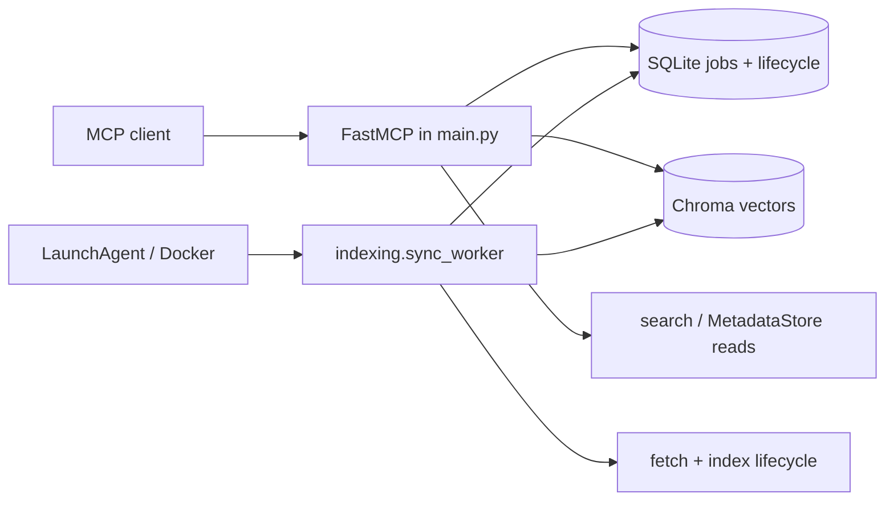
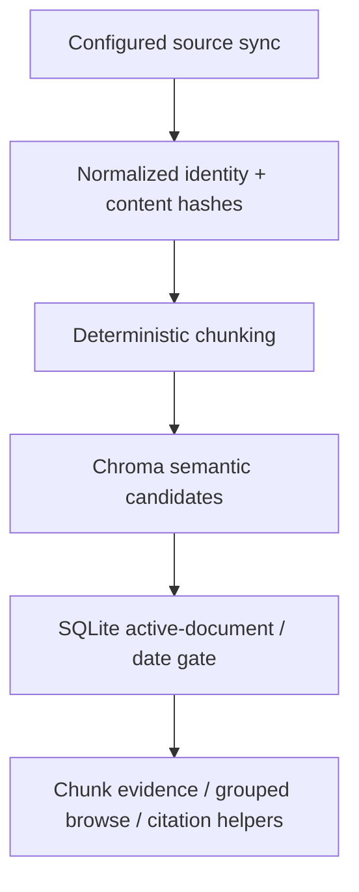
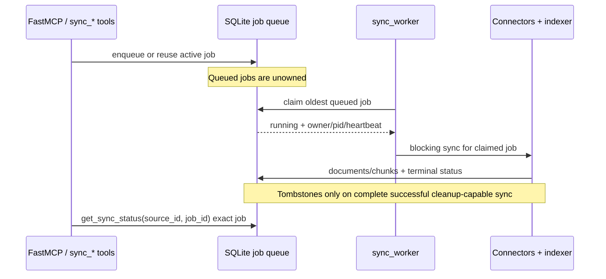
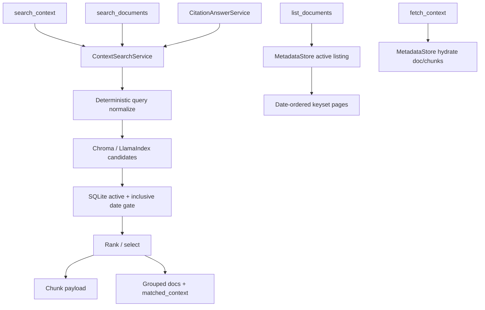

# Architecture

## Purpose

Maintained design reference for slim `MCPContentSearch`. Harness planning and
review use it to keep changes inside the focused MCP retrieval scope and to
catch contract or data-safety regressions. Prefer diagrams and short constraint
bullets over essays; do not invent behavior beyond current implementation.

## Runtime Structure



| Concern | Rule |
| --- | --- |
| Config | FastMCP and worker each snapshot config/connectors at startup. Operators must restart both processes after `.env` / source-target changes — LaunchAgent: restart script; Docker worker: recreate with `docker stop`/`rm` + same `docker run ... --env-file` (`docker restart` keeps old env) |
| SQLite connections | Operation-scoped: short-lived connection, transaction commit/rollback, deterministic close (no GC reliance) |
| Authority | SQLite = lifecycle + citation gate; Chroma = retrieval accelerator only |
| LaunchAgent | Process supervisor only — not a queue, scheduler DB, or lifecycle authority |

### LaunchAgent constraints (compressed)

- Fail-closed privacy sanitizer on startup stderr (credentials, Cookie/Set-Cookie, provider URLs, local paths); same sanitizer before SQLite error text and MCP responses
- Sanitizer import/runtime failure appends only a fixed bounded diagnostic — never the rejected raw stream
- launchd stdout/stderr are not used as unbounded persistent logs; retained Python logs rotate and stay privacy-filtered
- Installer secures default log dir `0700` (custom dirs must already meet ownership/mode or install fails)
- Exclusive per-label install/restart/uninstall lock; PID + process-start reclaim rules; status helper is read-only and unlocked
- Uninstall targets `gui/<uid>/<label>`, not plist path
- Identical-config install: leave loaded service; bootstrap unloaded. If the rendered plist changed, plain install **stops with guidance** and does not silently apply — use explicit `--restart` (transactional; restores prior plist on bootstrap failure). A loaded service with a **missing** plist also needs explicit `--restart`; with no prior plist to restore, bootstrap failure leaves the service unloaded

## Module Map

| Module | Owns |
| --- | --- |
| `api/` | MCP tool contracts, formatting, caller-visible errors |
| `fetching/` | Notion, Tistory, GitHub, Obsidian connectors |
| `indexing/` | Worker claim/dispatch, chunking, Chroma mutation, sync lifecycle |
| `search/` | Retrieval, ranking, SQLite active gates, CitationAnswerService |
| `storage/` | SQLite source/job/document/chunk/tombstone metadata |
| `core/` | Shared models, exceptions, utilities |
| `environments/` | AppConfig, Chroma setup, token/env access |
| `main.py` | FastMCP composition/startup only |
| `deploy/launchd`, `scripts/` | macOS supervision helpers (not ingestion/persistence) |

New behavior starts in the owning module; avoid cross-module shortcuts in
`api/tools.py` when a service boundary fits.

### MetadataStore extraction caution

`storage/metadata_store.py` centralizes SQLite concerns. Future extraction must
preserve the public interface, method signatures, transaction semantics,
exception behavior, SQL schema, and MCP payloads. Move one boundary at a time;
verify with temp-SQLite storage tests then sync/retrieval/E2E. Do not inspect or
migrate user databases during internal extraction.

## Core Mental Model



- Source sync is the only retained ingestion entrypoint.
- SQLite is lifecycle + citation-safe evidence authority; Chroma is not.
- `search_context` = chunk evidence; `search_documents` = grouped browse with
  `matched_context`; `list_documents` = query-less date browse (no Chroma).
- `CitationAnswerService` is internal, on validated evidence — not a separate stack.
- Deterministic local query normalization only (no LLM query rewrite).

## Sync / Job Ownership



### Ownership & recovery

- Queued jobs stay pending when no worker is available; do not fail them for
  lack of a running owner.
- Running jobs carry owner/heartbeat; same-source sync is blocked while queued
  or live-owned.
- Recovery: stale jobs, unowned grace, dead owners; **PID-reuse caution**
  (especially Docker PID 1). Process-start identity (Linux `linux-v2` /
  Darwin) is definitive only in-scope; unknown/malformed/cross-namespace falls
  back to heartbeat staleness.
- MCP shutdown does not cancel worker jobs. Graceful worker signal → fail
  in-flight job **without** tombstones. Abrupt death → orphan recovery marks
  failed; v1 does not auto-resume partial work. After the orphaned job is
  terminal `failed`, callers enqueue a **fresh** sync.

### Tombstone safety

Tombstones only after a **complete successful** cleanup-capable snapshot.
Failed, partial, or bound-truncated snapshots must not tombstone absences.

### Public job status vs phases

Public `job.status` (what observers poll): `queued` → `running` → terminal
`succeeded` or `failed`. Do **not** treat phase names as status.

Running-only progress hints on `get_sync_status` use a separate `phase` field
(suppressed again once `job.status` is terminal):

| Phase | `upstream_total_pages` | `upstream_fetched_pages` |
| --- | --- | --- |
| `starting` | — | — |
| `discovering_pages` | discovered so far | `0` |
| `fetching_page_content` | final discovered count | bodies fetched so far |
| `indexing_documents` | (final) | (final) |

Persisted phases also include terminal markers `completed` / `failed` (else
empty). Free-form text only in sanitized `status_message` / `error_message`.

### `sync_source` / `sync_all`

- `sync_source`: enqueue/reuse; return queued or already-running immediately.
  Disabled source → terminal failed in the same write transaction. No silent
  in-process long-running fallback when the worker is down.
- Worker claims **one** job at a time across all sources (shared Chroma/connector safety).
- `sync_all`: launch acceptance only (`started` / `already_running` / `skipped` /
  `failed`; aggregate `accepted` / `partial` / `failed`). Completion via paced
  exact `get_sync_status(source_id, job_id)` — not `latest_job`.
- Observation (ADR 0009): paced exact `get_sync_status(source_id, job_id)` reads
  the `job` payload — never substitute a newer `latest_job` on errors or when
  attributing completion. Stop a target when exact `job.status` is terminal
  `succeeded` or `failed`. Start 2s, backoff cap 10s, one overall 5-minute
  deadline measured from the start of completion observation after `sync_all`
  returns; also stop after 3 consecutive status errors or missing exact `job`;
  a successful exact-job response resets that target's consecutive error count;
  deadline reports still-running IDs without cancelling — observation may
  **resume later with the same exact IDs**. Server does not push or auto-poll.
- Omitting `job_id` keeps latest-one-source / all-source shapes for current-state
  inspection only.

## Retrieval



## MCP Tool Contract

```text
list_sources() -> dict
sync_source(source_id: str) -> dict
sync_all() -> dict
get_sync_status(source_id: str = "", job_id: str = "") -> dict
search_context(query, filters=None, top_k=10, include_debug=False) -> dict
search_documents(query, filters=None, sort_by="relevance", sort_order="desc", top_k=10) -> dict
list_documents(filters=None, sort_by="indexed_at", sort_order="desc", page_size=20, cursor=None) -> dict
fetch_context(document_id="", chunk_id="") -> dict
```

**Intent (short):**

- Filters: `source_id` / `source_ids` (union if both), inclusive UTC date bounds
  (`published_*`, `modified_*`, `indexed_*`); offset-free timestamps = UTC;
  date-only values start at midnight UTC; unknown fields rejected.
- `search_context`: chunk evidence; date gate in SQLite; optional `debug`
  (`{}` when `include_debug=False` except `no_matching_sources` exception).
- `search_documents`: same path, one row/doc, best chunk text as
  `matched_context` (not `preview`); optional date sort within semantic set.
- `list_documents`: no query; SQLite browse; `page_size` 1–50; opaque
  `next_cursor` must be reused unchanged with the same filters/sort; public
  rows expose only `document_id`, `source_id`, `title`, `url`, `canonical_url`,
  `platform`, `published_at`, `modified_at`, `indexed_at`, `date_provenance`
  — no content/local paths.
- Public search results expose normalized timestamps + `date_provenance` (not
  legacy `date` / `updated_at` reinterpretation).
- `auth_ref` only `env:UPPER_CASE_NAME`; other forms normalize to empty; public
  formatting rejects noncanonical refs.
- Status fields: `latest_success_at`, `latest_failure_at`, `document_count`,
  `chunk_count`, `latest_failure_reason`, `stale_cleanup_disabled_reason`.
- Tool annotations: retrieval tools are not read-only/idempotent (schema init /
  heartbeat); `search_*` `openWorldHint=True` (default embeddings may egress);
  `list_documents` / `fetch_context` `openWorldHint=False`.
- Keep names, params, return shapes, and error vocabulary stable unless the
  user requested a contract change; never leak secrets or full local paths.

## Identity & Chunking

| Source | Stable identity | Dates / version | Notes |
| --- | --- | --- | --- |
| Notion | page id | `published_at`/`modified_at`, `date_provenance="notion"` | Skip `fetch_block_content` when active stored doc has content and canonical `modified_at` matches page `last_edited_time` (or `created_time`); batched skip/reuse fields only; skipped pages still in snapshot for `last_seen` / cleanup |
| Tistory | `blog_name:post_id` | `published_at`, `date_provenance="tistory"` | — |
| GitHub | repository path | blob SHA → `version_id` only (not a mod timestamp) | Prefix-scoped stale cleanup (below) |
| Obsidian | relative note path | mtime → `modified_at`, `date_provenance="filesystem"`; `obsidian://open` as citation URL | Local vault Markdown; not a live Obsidian app |

Lifecycle fields: `external_id`, `document_id`, `canonical_url`, `version_id`,
`published_at`, `modified_at`, `indexed_at`, `date_provenance`, `last_seen_at`,
`last_seen_sync_id`, `deleted_at`.

Chunking: heading markdown → plain-text windows → line-range code chunks.
Citation metadata per chunk includes `chunk_id`, `document_id`, `source_id`,
`title`, `url`, `path`, `chunk_index`, `line_start`/`line_end`, hashes, version,
timestamps, `date_provenance`.

## Persistence & Safety

| Store | Role |
| --- | --- |
| SQLite | Authority for source/job/document/chunk lifecycle, active gates, dates, listing, tombstones |
| Chroma | Semantic candidate accelerator; stale hits filtered via SQLite before evidence |

- Do not inspect, delete, reset, or migrate local Chroma/SQLite without explicit
  user approval, a plan, and rationale. Tests use temp paths/mocks.
- Soft-delete provenance: tombstones must suppress stale vectors even if
  best-effort Chroma cleanup lags.
- Normalized date columns are additive; legacy `date`/`updated_at` intact;
  empty timestamps until later sync — no forced reindex for that alone.
- **GitHub prefix cleanup:** under shared `source_github`, cleanup prefixes come
  only from repositories successfully resolved in that snapshot. One repo must
  not tombstone another; owner discovery never enables broad owner-prefix
  cleanup. Confirmed-empty repo (GitHub metadata) may tombstone its exact
  prefix after a complete sync; ambiguous empty metadata cannot.

### External sources (compressed)

- Notion / Tistory / GitHub / Obsidian as configured; disabled source blocks new
  syncs but does not hide already-active docs.
- GitHub: targets `owner`, `owner/repo`, `owner/repo@ref`; mixed targets must
  not overlap identities; bounds (files/bytes/pages) make incomplete snapshots
  and disable stale cleanup; listing endpoints capped (full page 100 → fail
  before index).
- Obsidian: vault path + file/byte bounds; over-bound → incomplete fail before cleanup.
- Default embeddings may egress to OpenAI unless overridden; no AppConfig
  embedding-provider switch. Local demo/E2E inject `MockEmbedding`.
- Live API or real-vault checks need explicit approval + plan; never print tokens
  or local path details.

## Configuration, Secrets, Errors

- Secrets: `environments/token.py`, `.env`, env vars, API keys — never in docs,
  tests, logs, screenshots, or examples.
- Domain exceptions in `core/exceptions.py`. Classify fetch errors near fetchers;
  search errors must not leak internals; indexing updates status before failure
  surfaces; tool messages stay user-readable without secrets.

## Testing & Harness

| Change type | Gate |
| --- | --- |
| Docs-only | path listing, `git status --short --branch`, `git diff --check`, stage + `git diff --cached --check` |
| Code/behavior | TDD unit + integration + deterministic E2E → `./scripts/verify_all.sh` before review/delivery |
| Functional E2E | `./scripts/verify_functional_e2e.sh` (temp data; no live API/LLM) |
| Live smoke / real vault | Explicit approval + plan only |

`harness-plan` and review gates must read this document before choosing
boundaries or approving contracts.

## Out of Scope

No production Web Console, Auto Wiki generation, generic website/docs crawling,
dynamic web fallback, or legacy live-search/indexing MCP tools.
