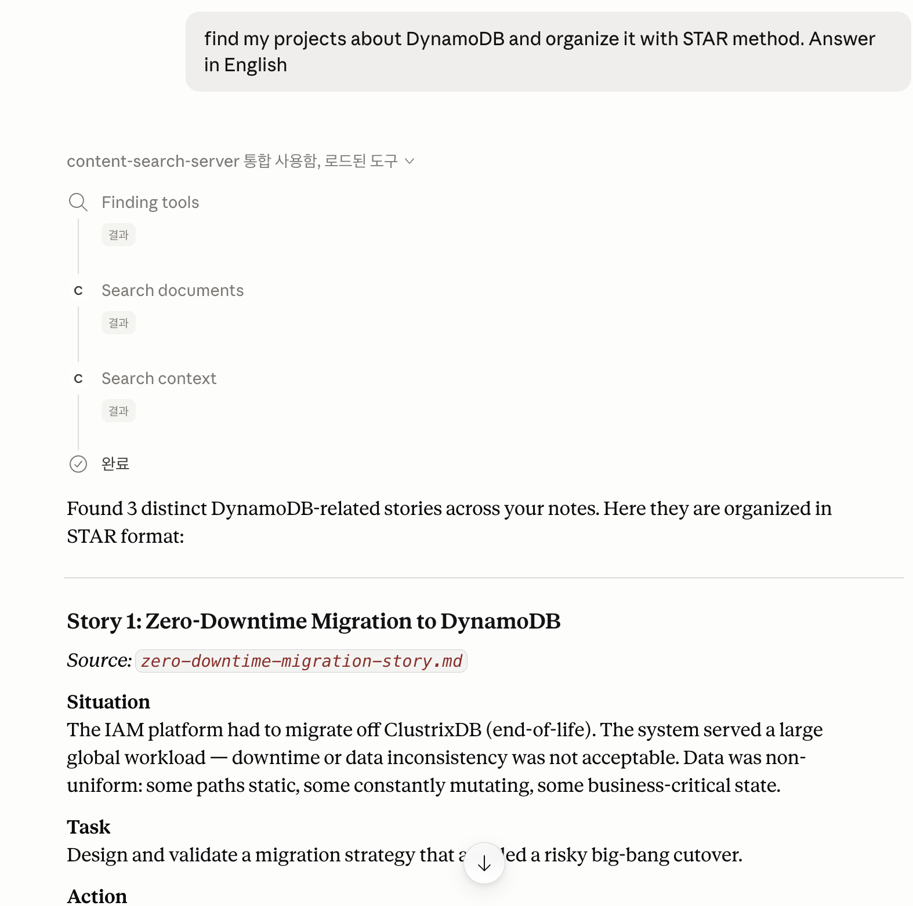

# ContextWiki

[](https://github.com/eunaverse/MCPContentSearch/actions/workflows/ci.yml)

**Self-hosted knowledge retrieval MCP server.** Syncs Notion · Tistory · GitHub · Obsidian into vector + metadata stores and returns citation-backed context.

---

## Architecture

```text
[ MCP client ]                         [ macOS LaunchAgent / Docker worker ]
       |                                        |
       v                                        v
[ FastMCP server ] -- enqueue --> [ SQLite jobs ] <-- claim -- [ Sync worker ]
       |                                |                         |
       v                                v                         v
 [ Search tools ] <-- SQLite active gate -- [ Chroma candidates + SQLite lifecycle ]
```

Two processes: **FastMCP enqueues jobs**; the **LaunchAgent or Docker worker claims and runs them**. Details: [Architecture](.agents/docs/architecture.md).

---

## MCP Tools

| Tool | Purpose |
|------|---------|
| `list_sources()` | List configured sources and state |
| `sync_source(source_id)` | Enqueue one source job (or return existing queued/running job) |
| `sync_all()` | Enqueue all configured sources; report each launch result immediately |
| `get_sync_status(source_id="", job_id="")` | Exact job (both IDs), latest for one source, or all sources |
| `search_context(query, ...)` | Citation-ready chunks after SQLite active-gate validation |
| `search_documents(query, ...)` | One result per matching document (relevance or date sort) |
| `list_documents(...)` | Browse active docs by date (no semantic query; cursor pagination) |
| `fetch_context(document_id="", chunk_id="")` | Fetch stored document/chunks by ID |

`matched_context` is specific to `search_documents`. Date/source `filters` (and sort/pagination options) are documented in [Architecture](.agents/docs/architecture.md).

| Source | `source_id` |
|--------|-------------|
| Notion | `source_notion` |
| Tistory | `source_tistory` |
| GitHub | `source_github` |
| Obsidian | `source_obsidian` |

**Example prompts**

| User asks | Tool |
|-----------|------|
| Which sources are connected? | `list_sources()` |
| Refresh Notion | `sync_source("source_notion")` |
| Refresh everything | `sync_all()`, then exact-job `get_sync_status` |
| Find evidence on X | `search_context(...)` |
| Newest docs from July | `list_documents(filters=..., sort_by="indexed_at")` |

---

## Quick Start

**Prerequisites:** Python `3.13`, [`uv`](https://docs.astral.sh/uv/)

```bash
uv sync --locked
cp .env.example .env
uv run --locked python main.py
```

This starts **only** the FastMCP process. Durable sync also needs the [sync worker](#durable-sync-worker). Queued jobs stay queued until a worker claims them.

**Docker** (MCP stdio + separate worker; share `.env` and the same named volume):

```bash
docker build -t contextwiki .
cp .env.example .env
docker run --rm -i --env-file .env \
  -v contextwiki_data:/home/appuser/.mcp_content_search contextwiki

docker run -d --name contextwiki-sync-worker --restart unless-stopped \
  --log-driver local --log-opt max-size=5m --log-opt max-file=3 \
  --env-file .env -v contextwiki_data:/home/appuser/.mcp_content_search \
  contextwiki /app/.venv/bin/python -m indexing.sync_worker
```

Bound Docker logs (`max-size` / `max-file`) — the container worker is not behind the LaunchAgent stderr sanitizer. `unless-stopped` restarts after a crash; `docker stop` leaves it stopped. Graceful stop fails the in-flight job; abrupt crash uses SQLite owner/heartbeat recovery.

For Obsidian in Docker: `-v "/path/to/vault:/vault:ro"` and `CONTEXTWIKI_OBSIDIAN_VAULT_PATH=/vault`.

---

## Configuration

| Source | Enable with |
|--------|-------------|
| Notion (`source_notion`) | `NOTION_API_KEY` |
| Tistory (`source_tistory`) | `TISTORY_BLOG_NAME` |
| GitHub (`source_github`) | `CONTEXTWIKI_GITHUB_REPOSITORIES` |
| Obsidian (`source_obsidian`) | `CONTEXTWIKI_OBSIDIAN_VAULT_PATH` |

Default embeddings need **`OPENAI_API_KEY`** (indexing/search may send text to OpenAI). Empty enable vars leave a source disabled.

```bash
OPENAI_API_KEY=...

NOTION_API_KEY=...
TISTORY_BLOG_NAME=devlog          # subdomain only, not full URL

CONTEXTWIKI_GITHUB_REPOSITORIES=eunaverse
# or: eunaverse/MCPContentSearch,eunaverse/website@main
GITHUB_TOKEN=...                  # private repos / higher rate limits

CONTEXTWIKI_OBSIDIAN_VAULT_PATH=/absolute/path/to/vault
```

GitHub targets: `owner`, `owner/repo`, or `owner/repo@ref` (comma/newline separated). Do not combine an owner with one of its repos. See [Architecture](.agents/docs/architecture.md) for resolution rules.

---

## Client setup

### Claude Desktop (local uv, recommended on macOS)

`~/Library/Application Support/Claude/claude_desktop_config.json`:

```json
{
  "mcpServers": {
    "content-search-server": {
      "command": "/absolute/path/to/uv",
      "args": [
        "--directory", "/absolute/path/to/MCPContentSearch",
        "run", "--python", "3.13", "python", "main.py"
      ]
    }
  }
}
```

Use `which uv` for the path. Put secrets in the repo `.env` (not plaintext in the config). If you previously set `OPENAI_API_KEY`, `NOTION_API_KEY`, `GITHUB_TOKEN`, or other source env vars in `claude_desktop_config.json` or a parent shell, clear those stale values too — leftover client/shell env bypasses `.env`. Both FastMCP and the durable worker snapshot source configuration at process startup, so fully restart the MCP client and run `./scripts/restart_sync_worker_launch_agent.sh` after `.env` or source-target changes.

### Claude Desktop (Docker)

```json
{
  "mcpServers": {
    "content-search-server": {
      "command": "docker",
      "args": [
        "run", "--rm", "-i",
        "--env-file", "/absolute/path/to/MCPContentSearch/.env",
        "-v", "contextwiki_data:/home/appuser/.mcp_content_search",
        "contextwiki:latest"
      ]
    }
  }
}
```

Keep the separate `contextwiki-sync-worker` container running (Quick Start). After `.env` edits, restart the MCP client and **recreate** the worker — `--env-file` is applied at `docker run` time, so `docker restart` keeps the old environment:

```bash
docker stop contextwiki-sync-worker && docker rm contextwiki-sync-worker
docker run -d --name contextwiki-sync-worker --restart unless-stopped \
  --log-driver local --log-opt max-size=5m --log-opt max-file=3 \
  --env-file .env -v contextwiki_data:/home/appuser/.mcp_content_search \
  contextwiki /app/.venv/bin/python -m indexing.sync_worker
```

After an intentional `docker stop` with no `.env` change, `docker start contextwiki-sync-worker` is enough (it stays stopped until you start it).

### Cursor

Add the same local uv block to `.cursor/mcp.json`.

---

## After connecting

1. **One source:** `sync_source("source_notion")` → if `queued`/`running`, keep `{source_id, job_id}` and poll exact-job `get_sync_status` until `succeeded` or `failed`. Immediate tool `failed` uses `error_message`; tool `error` uses `message`; after observation ends in `failed`, inspect `job.error_message`.
2. **All sources:** `sync_all()` once → check each `results[].launch_outcome` (`started` / `already_running` / `skipped` / `failed`). Retain `{source_id, job_id}` only for `started` and `already_running`.
3. **Observe:** paced exact-job status calls (not `latest_job`). Bounded observation policy (intervals, deadline, error handling): [Architecture](.agents/docs/architecture.md).
4. **Search/browse:** `search_context`, `search_documents`, or `list_documents` on succeeded sources.

`sync_all()` top-level status is launch acceptance (`accepted` / `partial` / `failed`), not sync completion.

**Example prompt:**
```text
find my projects about DynamoDB and organize it with STAR method. Answer in English
```



---

## Durable sync worker

FastMCP queues jobs; a separate worker claims them. Credentials stay in `.env`; the LaunchAgent plist holds only absolute paths.

**Foreground (dev):** `uv run --locked python -m indexing.sync_worker`

**macOS LaunchAgent:**

```bash
./scripts/install_sync_worker_launch_agent.sh --dry-run   # preview
./scripts/install_sync_worker_launch_agent.sh             # install/start
./scripts/status_sync_worker_launch_agent.sh
./scripts/restart_sync_worker_launch_agent.sh
./scripts/uninstall_sync_worker_launch_agent.sh
```

Use `--restart` when the rendered plist changed. Logs: `~/.mcp_content_search/logs/sync-worker.log` (and `sync-worker-startup.log`). Installing the LaunchAgent starts a persistent process that can access configured sources and the local SQLite/Chroma stores.

**Runtime**

- Stopping FastMCP/MCP client does **not** stop a worker-owned job.
- Stopping/uninstalling the worker stops execution (graceful → in-flight `failed`; abrupt → owner/heartbeat recovery). After recovery, wait until the orphaned job is terminal `failed`, then enqueue a **fresh** sync — v1 does not auto-resume partial work.
- `queued` = accepted, unclaimed; `running` = worker-owned; `succeeded`/`failed` = terminal.
- One job at a time across all sources.

Installer lock/sanitizer/log-rotation details: [Architecture](.agents/docs/architecture.md).

---

## Troubleshooting

| Symptom | Fix |
|---------|-----|
| MCP not discovered | Recheck config path; fully restart the client |
| Only works after manual start | Run `command` + `args` in a terminal to see errors |
| Invalid / duplicate GitHub target | Use `owner`, `owner/repo`, or `owner/repo@ref`; no overlapping owner+repo |
| Sync stays `queued` | LaunchAgent: `./scripts/status_sync_worker_launch_agent.sh` then install/restart. Docker: `docker start` (or recreate if `.env` changed) |
| Worker exits repeatedly | LaunchAgent: check `sync-worker-startup.log`, then `sync-worker.log`; `--dry-run` paths. Docker: `docker logs contextwiki-sync-worker` |
| MCP stopped but sync still `running` | Expected — LaunchAgent/Docker worker owns it |
| Source still disabled after `.env` change | Restart MCP client **and** worker. LaunchAgent: restart script. Docker: recreate the worker with the same `docker run ... --env-file` (not `docker restart`) |
| Worker stopped mid-sync | Restart/recreate worker; wait until orphaned job is `failed`; enqueue a fresh sync |
| Sync failed | Exact-job `get_sync_status(source_id, job_id)` for retained IDs; else latest by `source_id` |
| Obsidian in Docker | Mount vault **and** set `CONTEXTWIKI_OBSIDIAN_VAULT_PATH=/vault` |

Do not paste `.env`, tokens, or indexed content into diagnostics.

---

## Verification

```bash
./scripts/demo.sh                           # Run the local sample flow
./scripts/demo.sh --query "your question"
./scripts/verify_all.sh                     # full developer checks
```

`demo.sh` needs no credentials. It uses the bundled Obsidian sample vault, temporary SQLite and Chroma storage, and mock embeddings. Automated verification does not run live GitHub owner sync.

---

## Project structure

```text
main.py          FastMCP server entry point
api/             MCP tool handlers
core/            Shared models, exceptions, utilities
deploy/launchd/  macOS LaunchAgent template
environments/    Env var and secret loading
fetching/        Source connectors
indexing/        Chunking, sync worker, dedup, Chroma indexing
search/          Retrieval, ranking, active gate, citations
storage/         SQLite lifecycle metadata
tests/, scripts/ Verification harnesses and utilities
```
