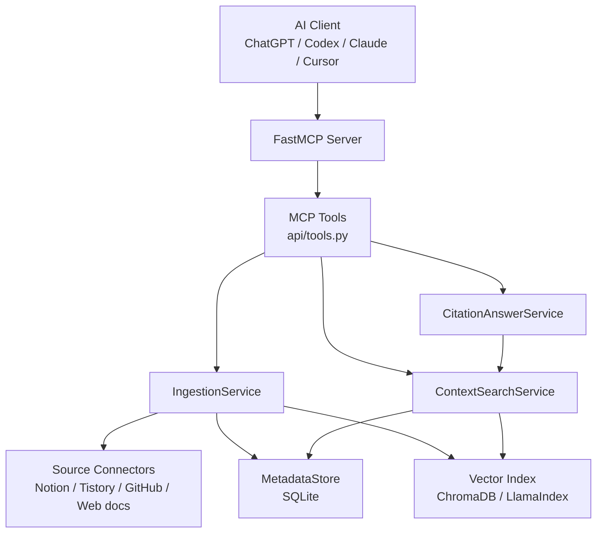
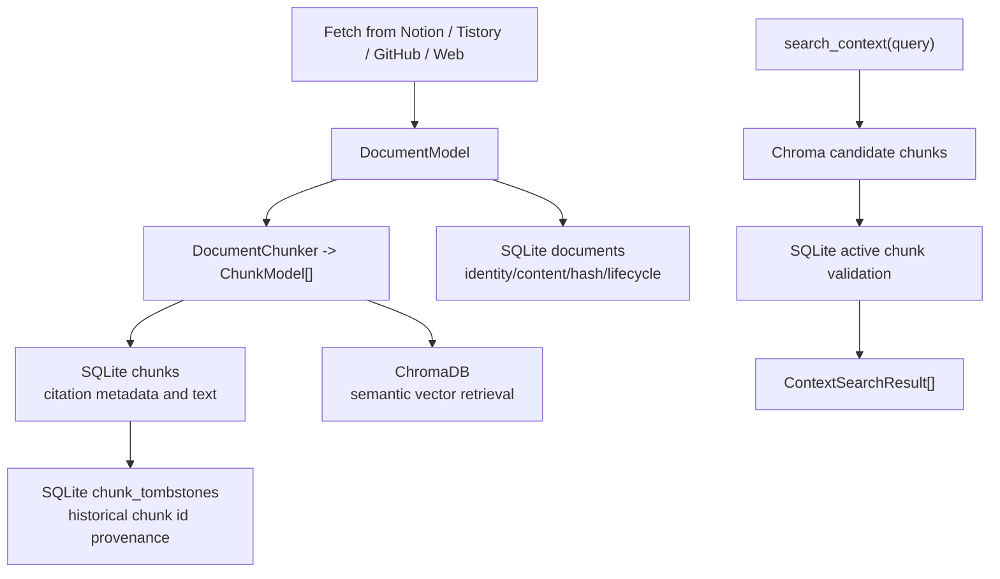
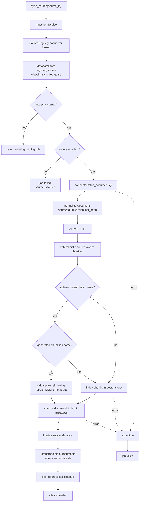
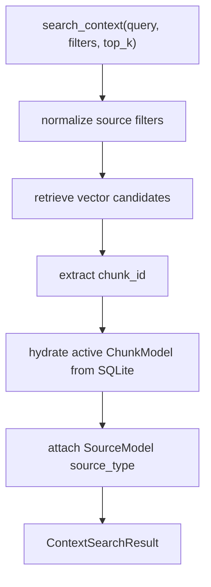
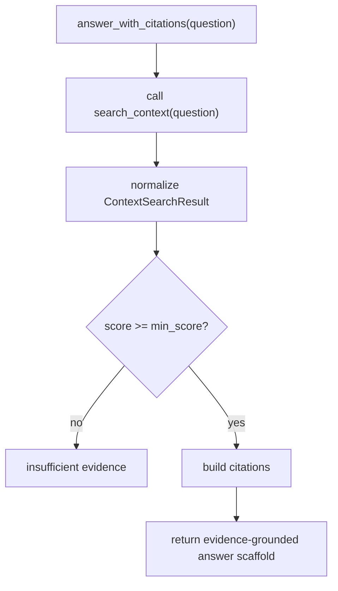
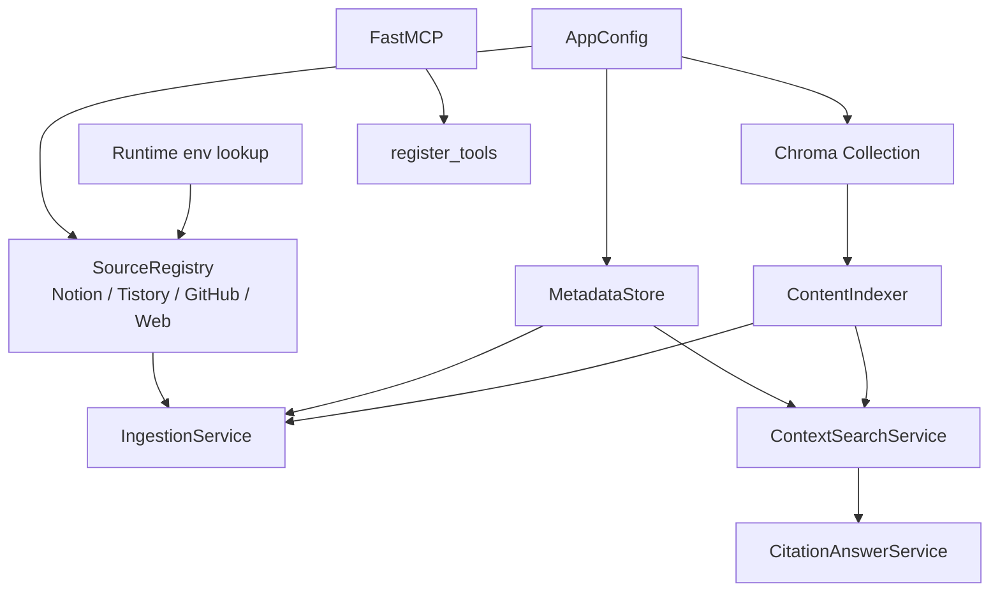

# ContextWiki Core Understanding Note

Baseline:

- Original baseline: `eunhwa99/MCPContentSearch` PR #2
- Updated through: Phase B-0 / PR #4
- Current update: Phase B GitHub/Web connectors / PR #6

Goal:

This note is not a source file walkthrough to memorize generated code. It is a
maintained mental model for explaining ContextWiki's design intent, data flow,
and current limitations.

When ContextWiki source, ingestion, lifecycle, retrieval, citation, or answer
behavior changes, update this note together with README, architecture docs, ADRs,
or plan docs as appropriate.

---

## 0. One-line Summary

ContextWiki extends the original `MCPContentSearch` project into an MCP-first
knowledge backend.

The core flow is:

```text
source registration
-> source sync
-> document fetch
-> external_id / canonical_url / version_id / last_seen metadata normalize
-> content_hash computation
-> deterministic source-aware chunking for chunk-id comparison
-> unchanged documents skip vector reindexing when hash and chunk ids match
-> new, changed, reappeared, or rechunked documents are stored in the vector index
-> source / job / document / chunk / tombstone metadata is stored in SQLite
-> cleanup-capable sources tombstone stale documents after complete successful snapshots
-> search_context asks Chroma for candidates and validates them through SQLite
-> answer_with_citations returns evidence-gated answers
```

Interview or README version:

```text
ContextWiki exposes MCP tools for source sync, incremental indexing,
citation-ready search, and evidence-gated answers.

It separates source metadata, sync jobs, original documents, citation chunks,
and search results so AI clients can retrieve grounded context without
accessing the database directly.

SQLite is the source of truth for lifecycle and citation metadata,
while ChromaDB is a semantic retrieval index.
```

---

## 1. Current Source Coverage

ContextWiki currently has source connectors for:

| Source | Source id | How it is configured | Notes |
| --- | --- | --- | --- |
| Notion | `source_notion` | existing Notion env settings | page/document source |
| Tistory | `source_tistory` | existing Tistory env settings | blog post source |
| GitHub | `source_github` | `CONTEXTWIKI_GITHUB_REPOSITORIES`, optional `GITHUB_TOKEN` | repository file source |
| Web/docs | `source_web` | `CONTEXTWIKI_WEB_URLS` | sitemap or bounded same-origin docs source |

So yes: ContextWiki can now bring in GitHub content when repositories are
configured.

Example:

```bash
CONTEXTWIKI_GITHUB_REPOSITORIES="eunhwa99/MCPContentSearch@main"
GITHUB_TOKEN="..."
```

Then:

```text
sync_source("source_github")
```

will fetch supported text/code/markdown files from the configured repository,
convert each file into a `DocumentModel`, chunk it with line-range citation
metadata, index the chunks, and store lifecycle metadata in SQLite.

Web/docs works similarly:

```bash
CONTEXTWIKI_WEB_URLS="https://docs.example.com/sitemap.xml,https://docs.example.com/start"
```

Then:

```text
sync_source("source_web")
```

fetches sitemap entries or bounded same-origin pages, respects robots.txt
disallow rules, extracts readable text and canonical URLs, and indexes the
resulting documents.

---

## 2. Overall Mental Model

ContextWiki is easiest to understand as four layers.



Important design intent:

```text
AI clients do not read the database directly.
AI clients call MCP tools.

ChromaDB finds semantically relevant candidate chunks.
SQLite decides whether those chunks are currently active, citeable evidence.
```

---

## 3. Core Model Relationships

Relevant files:

```text
core/models.py
storage/metadata_store.py
```

The most important models are:

| Model | Meaning | Main use |
| --- | --- | --- |
| `SourceModel` | Notion, Tistory, GitHub, Web/docs source | source configuration and sync state |
| `SyncJobModel` | one source sync execution | success/failure and processing counts |
| `DocumentModel` | one original document | identity, content hash, lifecycle, source metadata |
| `ChunkModel` | searchable/citeable document segment | vector search and citations |
| `ContextSearchResult` | search response DTO | chunk + score + preview + citation metadata |

Key distinction:

```text
DocumentModel = management and sync unit
Examples: one Notion page, one Tistory post, one GitHub file, one web page.

ChunkModel = search and citation unit
Examples: a markdown section, a code line range, a plain-text window.

ContextSearchResult = response DTO
ChunkModel + score + source_type + preview + version metadata.
```

---

## 4. SQLite vs ChromaDB

SQLite and Chroma both store chunk-related information, but they have different
jobs.

```text
SQLite MetadataStore
= source/job/document/chunk lifecycle source of truth

ChromaDB
= semantic retrieval candidate index
```



Important explanation:

```text
SQLite is not just a metadata cache. It is the active truth gate.
ChromaDB is a helper index for semantic candidate retrieval.

Search results are not trusted directly from Chroma.
They are hydrated and validated through SQLite.
```

---

## 5. MCP Tool Surface

Relevant file:

```text
api/tools.py
```

Current ContextWiki tools:

| Tool | Input | Return | Use |
| --- | --- | --- | --- |
| `list_sources()` | none | configured sources | see available sources |
| `sync_source(source_id)` | source id | sync job result | refresh one source |
| `get_sync_status(source_id?)` | optional source id | source/job status | inspect sync state |
| `search_context(query, filters, top_k)` | query/filter/top_k | structured chunk results | find evidence |
| `fetch_context(document_id, chunk_id)` | document or chunk id | original document/chunk | inspect evidence |
| `answer_with_citations(question, filters, top_k)` | question/filter/top_k | answer + citations | answer from evidence |
| `generate_wiki_page(topic, filters, top_k)` | topic/filter/top_k | Markdown wiki page + citations/backlinks | generate a read-only Auto Wiki page from evidence |

`model_dump(mode="json")` means:

```text
Convert Pydantic models into JSON-safe dict/list values for MCP responses.
```

---


### Auto Wiki Generation

`generate_wiki_page(topic, filters, top_k)` is the first Phase C surface. It does not persist wiki pages and does not call external connectors directly. The tool delegates to `WikiGenerationService`, which delegates to `ContextSearchService`, then emits a stable response with:

```text
topic, status, title, markdown, sections, citations, backlinks, used_chunks
```

The generated page is citation-gated: low-score or missing evidence returns `status="insufficient_evidence"` instead of creating a weak wiki page. `backlinks` are derived from the distinct source documents represented by the used chunks.

---

## 6. Sync and Incremental Indexing

Relevant files:

```text
indexing/ingestion_service.py
indexing/chunker.py
indexing/indexer.py
storage/metadata_store.py
```

`IngestionService.sync_source()` is the core business flow.



Incremental indexing:

```text
If active document content_hash is unchanged and generated chunk ids are
unchanged, skip reindexing.
```

Documents are still deterministically chunked before the skip decision so the
sync can compare generated chunk ids and refresh SQLite lifecycle metadata.

Reindexing still happens when:

```text
- a tombstoned document reappears
- content changes
- generated chunk ids change
- document identity changes
```

Source/document/chunk ownership or contract mismatches are rejected instead of
being repaired by vector reindexing. Metadata-only updates may refresh SQLite
without rewriting Chroma when hash and chunk ids match.

Example sync result:

```json
{
  "job_id": "uuid",
  "source_id": "source_github",
  "status": "succeeded",
  "total_documents": 25,
  "processed_documents": 3,
  "indexed_chunks": 18,
  "skipped_documents": 22,
  "error_message": ""
}
```

Interpretation:

```text
The connector observed 25 documents.
22 were unchanged and skipped for vector reindexing.
3 were new, changed, reappeared, or rechunked.
Those 3 processed documents produced 18 indexed chunks.
```

---

## 7. Source-aware Chunking

Relevant file:

```text
indexing/chunker.py
```

`DocumentChunker` converts original documents into citation-ready chunks.

```text
DocumentModel.content -> ChunkModel[]
```

Why chunking exists:

```text
A full document can be too long, too broad, and too imprecise for retrieval.
Chunking keeps embeddings focused and makes citations point to smaller evidence.
```

Current chunking strategy:

```text
Markdown with headings
-> heading / section based chunks

Markdown without headings
-> deterministic plain-text fallback windows

Code
-> deterministic line-range chunks
-> blank lines preserved
-> long lines split by max_chars
-> function/class-aware parsing remains later work

Plain text
-> deterministic character windows
```

Each chunk carries citation metadata:

```text
chunk_id
document_id
source_id
title
url
path
chunk_index
line_start
line_end
content_hash
version_id
updated_at
```

Interview wording:

```text
DocumentChunker converts original documents into citation-ready chunks.
Markdown with headings is split by sections, headingless Markdown falls back to
deterministic text windows, code is chunked with deterministic line ranges, and
plain text falls back to deterministic character windows.
```

---

## 8. Document Identity and Versioning

Relevant fields:

| Field | Meaning |
| --- | --- |
| `source_id` | which ContextWiki source owns the document |
| `external_id` | stable id from the original system |
| `document_id` | internal canonical document id, usually `external_id` |
| `canonical_url` | primary URL used for citations and legacy matching |
| `version_id` | source version metadata, separate from stable identity |
| `last_seen_at` | last sync time that observed the document |
| `last_seen_sync_id` | job marker that observed the document |
| `deleted_at` | tombstone timestamp when missing from a cleanup-capable successful sync |

Current mapping:

```text
Notion
-> external_id = page_id
-> document_id = page_id

Tistory
-> external_id = blog_name:post_id
-> document_id = blog_name:post_id

GitHub
-> external_id/document_id = github:owner/repo:path
-> canonical_url = GitHub blob URL at the resolved commit
-> version_id = blob SHA

Web/docs
-> external_id/document_id = web:canonical_url
-> canonical_url = extracted canonical URL or final URL
-> version_id = safe ETag or Last-Modified validator when available
```

Important distinction:

```text
Stable identity should not change just because content changes.
version_id records source revision metadata.
content_hash records actual indexed content.
```

Still not implemented:

```text
- rename/move detection
- fingerprint-based duplicate detection
- automatic remap when external_id changes
```

So today:

```text
external_id changed + same content
= new document create; for cleanup-capable sources after a complete successful
  snapshot, the old missing document is tombstoned
```

---

## 9. Tombstones and Stale Vector Safety

Tombstone means soft delete, not hard delete.

```text
documents.deleted_at records when a document disappears from a cleanup-capable
source after a complete successful sync.
```

Example:

```text
GitHub file api/tools.py is deleted
-> next complete cleanup-capable successful GitHub sync does not see that external_id
-> documents.deleted_at is set
-> active search excludes it
-> if stale Chroma vectors remain, SQLite validation blocks them
```

Why not hard delete immediately?

```text
Vector cleanup is best-effort.
If Chroma cleanup fails, SQLite still needs historical provenance to suppress
stale managed vector hits.
```

Current strategy:

```text
documents.deleted_at
-> document tombstone

chunks rows
-> active/citation metadata and provenance

chunk_tombstones
-> pre-replacement historical chunk-id provenance
```

Stale document cleanup uses `documents.deleted_at` while preserving chunk-row
provenance for SQLite-backed stale vector suppression.

SQLite is the last defense against stale vector results.

---

## 10. Managed Vector Boundary

ContextWiki-managed chunks are marked in Chroma metadata:

```text
contextwiki_managed = true
```

`search_context` flow:

```text
Chroma candidate
-> extract chunk_id
-> hydrate ChunkModel from SQLite
-> validate source_id/document_id/managed marker
-> ensure document is not tombstoned
-> return ContextSearchResult
```

Legacy raw Chroma rows may still exist. `search_context` filters for managed
ContextWiki vectors only. Legacy `search_content` suppresses unmanaged hits that
match known ContextWiki document or chunk identities so old raw vectors do not
bypass the SQLite lifecycle gate.

Goal:

```text
Old raw vectors should not bypass the SQLite lifecycle gate.
```

---

## 11. search_context vs answer_with_citations

Relevant files:

```text
search/context_service.py
search/answer_service.py
api/tools.py
```

```text
search_context = find evidence
answer_with_citations = answer only from evidence
```

`search_context`:



`answer_with_citations`:



Current limitation:

```text
answer_with_citations is an evidence-gated answer scaffold.
It is not yet a full LLM generation pipeline.
```

Future direction:

```text
retrieve_context
-> grade_evidence
-> generate_answer_with_llm
-> verify_citations
-> return grounded answer
```

---

## 12. App Wiring

Relevant files:

```text
main.py
fetching/connectors.py
environments/config.py
environments/runtime_env.py
api/tools.py
```

`main.py` composes the application:



GitHub secrets are read only at runtime through environment lookup. Source
metadata stores environment references such as `env:GITHUB_TOKEN`, not raw
tokens.

---

## 13. README / Interview Architecture Summary

Short version:

```text
ContextWiki is an MCP-first knowledge backend that indexes external sources
incrementally and exposes citation-ready search and evidence-gated answer tools
to AI clients.
```

Longer version:

```text
The system separates source metadata, sync jobs, original documents, citation
chunks, and search result DTOs. During sync, it fetches documents from a source
connector, normalizes source identity and version metadata, deterministically
chunks documents for chunk-id comparison, skips vector reindexing when content
hash and chunk ids are unchanged, writes chunks for new, changed, reappeared,
or rechunked documents to the vector index, and stores lifecycle metadata in
SQLite. AI clients use MCP tools such as search_context and answer_with_citations
to retrieve grounded context without directly accessing the database.
```

Current Phase B version:

```text
Phase B adds GitHub and Web/docs connectors. GitHub repositories are indexed as
file-level documents with stable path-based identity, GitHub blob SHA versioning,
line-range citations, and conservative stale cleanup. Web/docs sources support
configured seed URLs or sitemaps, robots-aware bounded crawling, canonical URL
identity, readable text extraction, and validator-based version metadata.
```

Honest limitation version:

```text
The current implementation builds the production safety foundation:
source/job metadata, document identity, source-aware chunking, tombstone-based
stale cleanup, SQLite-backed active retrieval checks, historical chunk-id
provenance, GitHub/Web connectors, structured context search, and citation-gated
answer responses.

It does not yet include fingerprint dedup, rename detection, function/class-aware
code chunking, queue-based retry, full ACL-aware retrieval, evaluation metrics,
reranking, query rewriting, citation verification, or LLM-based answer
generation.
```

---

## 14. Files to Understand First

1. `core/models.py`
   - Shared data contracts: source, job, document, chunk, search result.

2. `api/tools.py`
   - MCP entry points exposed to AI clients.

3. `indexing/ingestion_service.py`
   - Source sync and incremental indexing lifecycle.

4. `indexing/chunker.py`
   - Document-to-citation-chunk conversion.

5. `storage/metadata_store.py`
   - SQLite source/job/document/chunk/tombstone metadata.

6. `fetching/connectors.py`
   - Source registry and connector composition.

7. `fetching/github.py`
   - GitHub repository file ingestion.

8. `fetching/web_docs.py`
   - Website/docs crawler and text extraction.

9. `search/context_service.py`
   - Chroma candidate search plus SQLite active chunk hydration.

10. `search/answer_service.py`
    - Evidence-gated answer and citation response.

11. `main.py`
    - Dependency composition.

---

## 15. Current Limitations

Still not implemented:

```text
- fingerprint-based duplicate detection
- rename/move detection
- function/class-aware DocumentChunker code parsing
- worker queue
- retry/backoff
- idempotency hardening beyond current source sync guards
- ACL-aware retrieval
- tenant/source permission model
- full audit logs
- eval-driven retrieval tuning
- reranking
- query rewriting
- citation verification
- LLM answer generation
```

Deferred or non-default validation:

```text
- live external smoke tests are outside required/default verification and should
  remain explicit opt-in when added or expanded
```

Document identity limitation:

```text
If external_id changes while content stays identical, ContextWiki does not merge
the documents today.

Current:
external_id changed -> new document create; old document is tombstoned only when
cleanup applies for that source/snapshot

Future:
fingerprint dedup / rename detection could identify same-document candidates.
```

---

## 16. Self-check Questions

You understand the core if you can explain:

- Difference between `SourceModel`, `DocumentModel`, and `ChunkModel`.
- Why documents are chunked before vector indexing.
- How Markdown/code/plain text chunking differs.
- Difference between `document_id`, `external_id`, `canonical_url`, and `version_id`.
- Why GitHub blob SHA is version metadata, not stable document identity.
- How `content_hash` supports incremental indexing.
- Meaning of `processed_documents`, `skipped_documents`, and `indexed_chunks`.
- Why tombstones use `deleted_at` instead of hard delete.
- Why `chunk_tombstones` exists.
- Why SQLite is the active truth gate and Chroma is not.
- Difference between `search_context` and `answer_with_citations`.
- Why `ContextSearchResult` exists.
- Difference between legacy raw vectors and ContextWiki-managed vectors.
- What GitHub/Web connectors currently support and intentionally do not support.

---

## 17. Next Study Topics

Good next topics:

```text
1. GitHub/codebase connector details
   - DocumentModel.path
   - line_start / line_end
   - GitHub blob URL citation
   - blob SHA version_id

2. Website/docs connector details
   - sitemap discovery
   - robots.txt handling
   - canonical URL identity
   - ETag / Last-Modified version metadata

3. source-aware chunking hardening
   - Markdown heading semantics
   - code function/class parsing
   - plain text paragraph splitting

4. document identity hardening
   - fingerprint dedup
   - rename/move detection
   - external_id remapping

5. production ingestion hardening
   - worker queue
   - retry/backoff
   - idempotency
   - stale document cleanup observability

6. retrieval quality
   - reranking
   - query rewriting
   - retrieval hit rate
   - MRR
   - citation correctness

7. answer quality
   - LLM generation
   - citation verification
   - grounded answer evaluation

8. LangGraph workflow
   - retrieve
   - grade evidence
   - generate
   - verify citations
   - return answer
```
