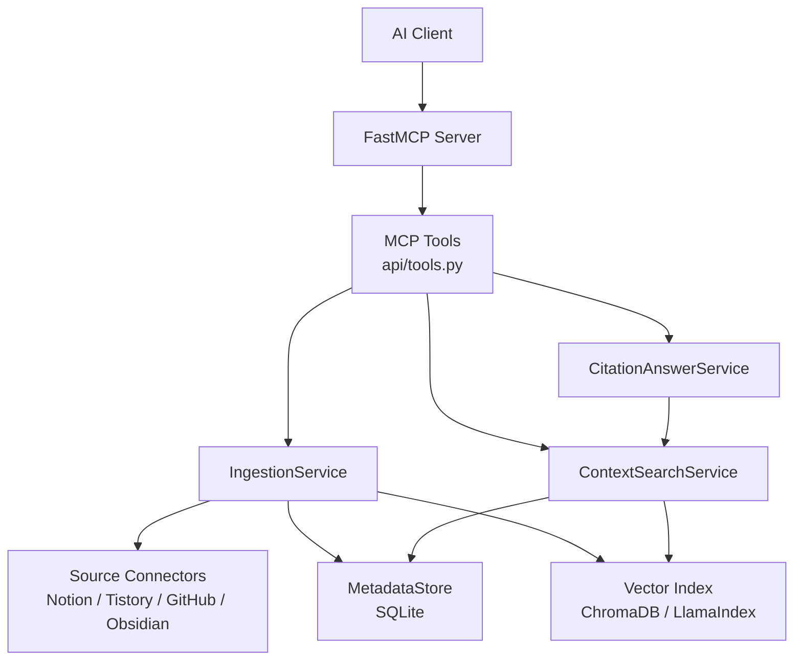
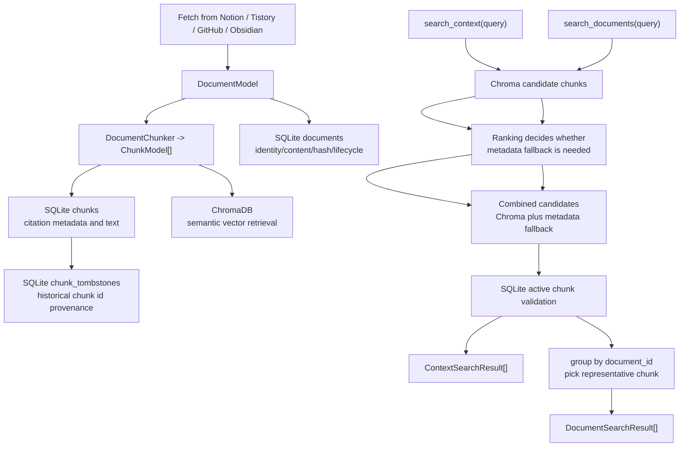

# ContextWiki Core Understanding Note

Baseline:

- Original baseline: `eunhwa99/MCPContentSearch` PR #2
- Current update: slim MCP core refactor with PR #25 Obsidian restoration,
  retaining GitHub/Notion/Tistory/Obsidian source sync, SQLite lifecycle
  metadata, Chroma retrieval, and citation-backed answers.

Goal:

This note is the maintained mental model for explaining ContextWiki's current
design intent, data flow, and limitations. When source connectors, ingestion,
lifecycle metadata, retrieval, citation, or answer behavior changes, update this
note together with README, architecture docs, ADRs, or plan docs as appropriate.

---

## 0. One-line Summary

ContextWiki is a focused MCP retrieval server.

The core flow is:

```text
source registration
-> source sync
-> document fetch from Notion, Tistory, GitHub, or Obsidian
-> external_id / canonical_url / version_id / last_seen metadata normalize
-> content_hash computation
-> deterministic source-aware chunking for chunk-id comparison
-> unchanged documents skip vector reindexing when hash and chunk ids match
-> new, changed, reappeared, or rechunked documents are stored in Chroma
-> source / job / document / chunk / tombstone metadata is stored in SQLite
-> cleanup-capable sources tombstone stale documents after complete snapshots
-> search_context may optionally rewrite weak queries through a configured LLM
   when CONTEXTWIKI_SEARCH_LLM_ENABLED=true
-> answer_with_citations inherits that same query-rewrite egress because it
   calls search_context through search_context_for_answer / search_context
-> search debug output reports whether rewrite was disabled, skipped, attempted,
   or applied
-> retrieval starts from Chroma candidates when available, then may add
   metadata-fallback candidates before SQLite validation
-> retrieval policy keeps vector score and rerank score separate in debug, uses
   named rerank/rewrite thresholds in code, and no longer treats a bare
   lowercase long token as an implicit GitHub repo probe without explicit
   repository-style evidence such as GitHub/repository wording, a strong
   repo-shaped anchor, or a curated compound alias
-> retrieval candidates are hydrated through SQLite before citation use
-> search_context asks Chroma for candidates, may add metadata fallback, and
   validates managed hits through SQLite
-> search_documents groups those validated candidates by document and keeps one
   representative chunk per document for browsing
-> answer_with_citations returns a helper evidence-gated answer preview
```

Interview or README version:

```text
ContextWiki exposes MCP tools for source sync, incremental indexing,
citation-ready chunk search, grouped document browsing, context fetch, and a
helper evidence-gated answer preview surface.

SQLite is the source of truth for lifecycle and citation metadata, while
ChromaDB is the semantic retrieval index.

In normal production MCP usage, downstream LLMs usually turn retrieved evidence
into the final natural-language answer. `answer_with_citations` is useful here
as a preview/debug/eval helper, not as the repository's core answer contract.
```

---

## 1. Current Source Coverage

ContextWiki currently has source connectors for:

| Source | Source id | How it is configured | Notes |
| --- | --- | --- | --- |
| Notion | `source_notion` | `NOTION_API_KEY` | page/document source |
| Tistory | `source_tistory` | `TISTORY_BLOG_NAME` | blog post source |
| GitHub | `source_github` | `CONTEXTWIKI_GITHUB_REPOSITORIES`, optional `@ref`, `CONTEXTWIKI_GITHUB_DEFAULT_REF`, file limits, optional `GITHUB_TOKEN` | repository file source |
| Obsidian | `source_obsidian` | `CONTEXTWIKI_OBSIDIAN_VAULT_PATH`, `CONTEXTWIKI_OBSIDIAN_MAX_FILES`, `CONTEXTWIKI_OBSIDIAN_MAX_FILE_BYTES` | local Markdown vault source |

Example:

```bash
CONTEXTWIKI_GITHUB_REPOSITORIES="eunhwa99/MCPContentSearch@main"
```

Then:

```text
sync_source("source_github")
```

fetches supported text/code/Markdown files from configured repositories,
converts each file into a `DocumentModel`, chunks it with line-range citation
metadata, indexes the chunks, and stores lifecycle metadata in SQLite.

If `@ref` is omitted from a repository spec, the GitHub connector uses
`CONTEXTWIKI_GITHUB_DEFAULT_REF`, which defaults to `main`. Fetch completeness
and stale-cleanup eligibility also depend on `CONTEXTWIKI_GITHUB_MAX_FILES` and
`CONTEXTWIKI_GITHUB_MAX_FILE_BYTES`. `GITHUB_TOKEN` is optional, and
`CONTEXTWIKI_GITHUB_USER_AGENT` controls the request header used by the fetcher.

Bulk retained-source sync is also available:

```text
sync_all()
```

This fans out one concurrent `sync_source()` run per retained source. Each
source still keeps its own SQLite running-job guard, so a source that is
already syncing is reported as blocked in the aggregate result instead of
starting a second overlapping fetch. The running-job guard also refreshes a
sync-owner heartbeat beside the per-job heartbeat during active running-job
metadata updates. When a previous owner still looks alive only because both old
and new containers report the app as PID `1`, startup recovery and
`begin_sync_job()` specifically fall back to the running job's own staleness
window before reclaiming the source, instead of treating the short unowned-job
grace as proof that the previous sync is dead.

Obsidian example:

```bash
CONTEXTWIKI_OBSIDIAN_VAULT_PATH="/path/to/temp-or-real-vault"
CONTEXTWIKI_OBSIDIAN_MAX_FILES=2000
CONTEXTWIKI_OBSIDIAN_MAX_FILE_BYTES=512000
```

Then:

```text
sync_source("source_obsidian")
```

reads bounded `.md` notes from the configured local vault, skips hidden and
Obsidian metadata directories, preserves frontmatter-derived titles when
available, uses `obsidian://open` canonical URLs, and stores lifecycle metadata
in SQLite. If the configured vault exceeds the max file count or per-file byte
bound, sync fails as an incomplete snapshot before stale cleanup. It does not
require a live Obsidian app.

If a retained connector is disabled for future syncs, already indexed active
documents are not automatically hidden from retrieval. They remain retrievable
until later cleanup or metadata changes mark them inactive.

---

## 2. Overall Mental Model

ContextWiki is easiest to understand as four layers.


```mermaid
flowchart TD
    Client["AI Client"]
    MCP["FastMCP Server"]
    Tools["MCP Tools<br/>api/tools.py"]
    Ingestion["IngestionService"]
    Search["ContextSearchService"]
    Answer["CitationAnswerService"]
    Store["MetadataStore<br/>SQLite"]
    Vector["Vector Index<br/>ChromaDB / LlamaIndex"]
    Sources["Source Connectors<br/>Notion / Tistory / GitHub / Obsidian"]

    Client --> MCP
    MCP --> Tools
    Tools --> Ingestion
    Tools --> Search
    Tools --> Answer
    Ingestion --> Sources
    Ingestion --> Store
    Ingestion --> Vector
    Search --> Vector
    Search --> Store
    Answer --> Search
```

Important design intent:

```text
AI clients do not read the database directly.
AI clients call MCP tools.

ChromaDB finds semantically relevant candidate chunks.
SQLite decides whether those chunks are currently active, citeable evidence.
```

---

## 3. MCP Tool Surface

Current tools:

| Tool | Use |
| --- | --- |
| `list_sources()` | see configured sources |
| `sync_source(source_id)` | refresh one source |
| `sync_all()` | refresh all retained sources concurrently and return aggregate results |
| `get_sync_status(source_id?)` | inspect source/job state |
| `search_context(query, filters, top_k, include_debug)` | find SQLite-validated evidence |
| `search_documents(query, filters, top_k)` | browse unique matching documents through one representative chunk per document |
| `fetch_context(document_id, chunk_id)` | inspect one document or chunk |
| `answer_with_citations(question, filters, top_k, include_debug)` | helper answer preview from validated evidence |

The retained `search_context` response always includes a public `debug` key.
On the normal default path `api/tools.py` returns `debug={}` unless
`include_debug=True`, and when caller filters leave no matching public sources
it still returns a small populated `debug` object even if `include_debug=False`.

The current debug payload includes rewrite decision fields:

```text
rewrite_enabled
rewrite_attempted
rewrite_applied
rewrite_skipped_reason
```

These fields explain whether query rewrite was disabled, not needed, or tried
without producing an applied rewrite.

Current rewrite policy keeps one more guardrail: a single high-confidence,
textually matching result may suppress rewrite even when `top_k` asks for more
rows, so `insufficient_candidate_count` alone does not force rewrite churn.

Observed `rewrite_skipped_reason` values include:

```text
disabled
not_needed
empty_result
rewrite_failed
no_matching_sources
no_term_groups
not_supported
```

Tool handlers call service boundaries and return JSON-safe values through
Pydantic `model_dump(mode="json")` where needed.

`include_debug=True` is the retained explainability switch for retrieval and
the helper answer preview surface. It is additive and opt-in for populated retrieval reasoning
on the normal success path: default `search_context` payloads still carry
`debug={}`, while debug payloads expose structured retrieval reasoning without
dumping raw local DB contents. The current exception is the public
`no_matching_sources` fast path in `search_context`, which still emits a small
populated `debug` object even when `include_debug=False`.
`answer_with_citations` does not mirror that exception path.

Verification layer split:

- Public MCP contract layer:
  real `FastMCP.call_tool(...)` payload checks for each retained public tool
- Deterministic functional E2E layer:
  retained sync/search/fetch/answer flow modules over temp/local state via
  `./scripts/verify_functional_e2e.sh`
- Deterministic quality eval layer:
  fixture retrieval and answer scoring via `tests/evals` and
  `scripts/run_contextwiki_eval.py`
- Manual live smoke layer:
  `scripts/live_query_smoke.py` against a user's configured local runtime;
  this is manual diagnostic evidence, not automated gate coverage
Retrieval split:

```text
search_context
= chunk-level retrieval for evidence, grounding, and citations

search_documents
= grouped document-browsing retrieval that reuses the same retained-source
  candidates but collapses repeated chunks into one representative row per
  document
```

Helper answer validation focuses on:

```text
citations
used_chunks
debug
debug_markdown
```

Those fields help developers compare the response draft against the retrieved
evidence and decide whether a downstream LLM would have enough grounded context
to answer well.
`list_sources()` and `get_sync_status()` expose additive reviewer-readable
operational fields per source:

```text
latest_success_at
latest_failure_at
document_count
chunk_count
latest_failure_reason
stale_cleanup_disabled_reason
```

Those fields come from SQLite lifecycle metadata plus runtime connector state.
Public error text still passes through the same redaction path used by other
sync/job payloads.

For reviewer-driven live local verification, the repo also includes:

```text
scripts/live_query_smoke.py
```

This script runs `search_context` and `answer_with_citations` against the local
configured environment through the retained tool handlers and prints a compact
safe summary of rewrite state, hits, helper answer preview status, and
citations. It is a manual live check surface, not a replacement for
deterministic non-live tests.

---

## 4. Core Model Relationships

Relevant files:

```text
core/models.py
storage/metadata_store.py
```

The most important models are:

| Model | Meaning | Main use |
| --- | --- | --- |
| `SourceModel` | Notion, Tistory, GitHub, or Obsidian source | source configuration and sync state |
| `SyncJobModel` | one source sync execution | success/failure and processing counts |
| `DocumentModel` | one original document | identity, content hash, lifecycle, source metadata |
| `ChunkModel` | searchable/citeable document segment | vector search and citations |
| `ContextSearchResult` | search response DTO | chunk + score + preview + citation metadata |
| `DocumentSearchResult` | grouped document search response DTO | one representative chunk-backed row per document |

Key distinction:

```text
DocumentModel = management and sync unit
Examples: one Notion page, one Tistory post, one GitHub file, one Obsidian note.

ChunkModel = search and citation unit
Examples: a markdown section, a code line range, a plain-text window.
```

---

## 5. SQLite vs ChromaDB

SQLite and Chroma both store chunk-related information, but they have different
jobs.

```text
SQLite MetadataStore
= source/job/document/chunk lifecycle source of truth

ChromaDB
= semantic retrieval candidate index
```


```mermaid
flowchart TD
    A["Fetch from Notion / Tistory / GitHub / Obsidian"]
    B["DocumentModel"]
    C["DocumentChunker -> ChunkModel[]"]
    D["SQLite documents<br/>identity/content/hash/lifecycle"]
    E["SQLite chunks<br/>citation metadata and text"]
    T["SQLite chunk_tombstones<br/>historical chunk id provenance"]
    F["ChromaDB<br/>semantic vector retrieval"]
    G["search_context(query)"]
    H["Chroma candidate chunks"]
    I["Ranking decides whether<br/>metadata fallback is needed"]
    J["Combined candidates<br/>Chroma plus metadata fallback"]
    N["SQLite active chunk validation"]
    O["ContextSearchResult[]"]
    K["search_documents(query)"]
    L["group by document_id<br/>pick representative chunk"]
    M["DocumentSearchResult[]"]

    A --> B --> C
    B --> D
    C --> E
    C --> F
    E --> T
    G --> H --> I --> J --> N --> O
    K --> H
    H --> I
    I --> J
    N --> L --> M
```

Search results are not trusted directly from Chroma. Retrieval starts with
vector candidates when available, may add metadata-fallback candidates when the
ranker decides lexical or source-aware recovery is needed, and then hydrates
and validates managed hits through SQLite before they become evidence,
citations, or grouped document rows.

When `search_context(..., include_debug=True)` is used, the response now makes
that decision path visible with reviewer-readable fields such as:

```text
intent.name / raw_name / confidence / reasons
query_rewrite.attempted / applied / reason
retrieval_queries
rewritten_queries
filters.source_ids
selected_results[]
```

`query_rewrite.reason` is intentionally coarse and stable. Current values are:

```text
no_initial_candidates
insufficient_candidate_count
missing_textual_match
low_initial_score
```

The retrieval path now also makes a coarse intent-policy decision before final
reranking. The current retained intent classes are:

```text
strict_lookup
broad_topic
list
comparison
```

This intent is deterministic and local-first. It is derived from normalized
query terms and anchors, then reused by ranking and grounded answer rendering.
It is not a separate MCP tool and does not require a live LLM call.

---

## 6. Sync and Incremental Indexing

Relevant files:

```text
indexing/ingestion_service.py
indexing/chunker.py
indexing/indexer.py
storage/metadata_store.py
```

`IngestionService.sync_source()` is the core per-source business flow, and
`IngestionService.sync_all()` is the retained-source aggregate fan-out entrypoint.

```text
sync_source(source_id)
-> SourceRegistry connector lookup
-> MetadataStore register_source + begin_sync_job guard
-> connector.fetch_documents()
-> normalize document source/id/url/version/last_seen
-> compute content_hash
-> deterministic source-aware chunking
-> skip vector reindexing when active content_hash and chunk ids are unchanged
-> index new/changed/reappeared/rechunked chunks in Chroma
-> commit document + chunk metadata
-> finalize successful sync
-> tombstone stale documents when cleanup is safe
-> best-effort vector cleanup
```

```text
sync_all()
-> SourceRegistry retained source enumeration
-> concurrent per-source sync_source() fan-out
-> one aggregate summary with succeeded / failed / blocked counts
-> per-source result payloads that preserve the latest job outcome
```

Reindexing still happens when:

```text
- a tombstoned document reappears
- content changes
- generated chunk ids change
- document identity changes
```

Failed or partial syncs must not tombstone missing documents.

---

## 7. Source-aware Chunking

Relevant file:

```text
indexing/chunker.py
```

Current chunking strategy:

```text
Markdown with headings
-> heading / section based chunks

Markdown without headings
-> deterministic plain-text fallback windows

Code
-> deterministic line-range chunks
-> blank lines preserved
-> long lines split by max_chars

Plain text
-> deterministic character windows
```

Each chunk carries citation metadata:

```text
chunk_id
document_id
source_id
title
url
path
chunk_index
line_start
line_end
content_hash
version_id
updated_at
```

---

## 8. Document Identity and Versioning

Relevant fields:

| Field | Meaning |
| --- | --- |
| `source_id` | which ContextWiki source owns the document |
| `external_id` | stable id from the original system |
| `document_id` | internal canonical document id, usually `external_id` |
| `canonical_url` | primary URL used for citations and legacy matching |
| `version_id` | source version metadata, separate from stable identity |
| `last_seen_at` | last sync time that observed the document |
| `last_seen_sync_id` | job marker that observed the document |
| `deleted_at` | tombstone timestamp when missing from a cleanup-capable successful sync |

Current mapping:

```text
Notion
-> external_id = page_id
-> document_id = page_id

Tistory
-> external_id = blog_name:post_id
-> document_id = blog_name:post_id

GitHub
-> external_id/document_id = github:owner/repo:path
-> canonical_url = GitHub blob URL at the resolved commit
-> version_id = blob SHA

Obsidian
-> external_id/document_id = relative/note/path.md
-> canonical_url = obsidian://open URL for the configured vault note
-> title = frontmatter title when present, otherwise note stem
```

Stable identity should not change just because content changes. `version_id`
records source revision metadata; `content_hash` records actual indexed content.

---

## 9. Tombstones and Stale Vector Safety

Tombstone means soft delete, not hard delete.

```text
documents.deleted_at records when a document disappears from a cleanup-capable
source after a complete successful sync.
```

For GitHub, cleanup is limited to repository document-id prefixes fetched by the
connector, such as `github:eunhwa99/mcpcontentsearch:`. This keeps one
configured repository sync from tombstoning documents that belong to another
repository scope under the same `source_github` source id.

For Obsidian, cleanup is allowed only after a complete local-vault snapshot.
Unreadable notes, traversal errors, or exceeded file count/byte bounds should
fail the sync before stale cleanup can tombstone missing active documents.

Why not hard delete immediately?

```text
Vector cleanup is best-effort.
If Chroma cleanup fails, SQLite still needs historical provenance to suppress
stale managed vector hits.
```

SQLite is the last defense against stale vector results.

---

## 10. Answer Behavior

`answer_with_citations` delegates retrieval to `ContextSearchService` and only
uses validated chunks as evidence. The answer response should make evidence
status explicit:

```text
grounded / insufficient / error
```

The service must not invent citations from unmanaged or tombstoned chunks. If
retrieval cannot find enough active evidence, the response should say that the
available evidence is insufficient instead of fabricating an answer.

When evidence is sufficient, the final rendered answer can now vary by request
shape while staying citation-grounded:

```text
summary-style answer for ordinary grounded QA
Grounded List for collection requests
Grounded Comparison for comparison requests
```

This is still bounded synthesis, not open-ended chat. The answer service only
repackages retrieved evidence chunks and keeps the same insufficient-evidence
escape hatch when retrieval is weak.

`search_documents` does not replace this evidence path. It is a browsing surface
for "which documents matched?" and keeps the highest-ranked chunk as the
representative row so callers can pivot into `fetch_context` or run a later
chunk-level citation workflow through `search_context` or
`answer_with_citations`.

---

## 11. Current Limits

Current intentional limits:

- No generic website/docs crawler in production scope.
- No browser Web Console or local HTTP reviewer UI in production scope.
- No Auto Wiki generation or LLM wiki synthesis in production scope.
- No dynamic web fallback or legacy live search/index MCP tools in production
  scope.
- No live Obsidian app, plugin, or API server requirement; Obsidian is a
  configured local-vault source.
- Optional `CONTEXTWIKI_SEARCH_LLM_ENABLED=true` query rewrite is disabled by
  default. If enabled, it may send the user query and normalized terms to the
  configured provider, but it must not send source evidence, fetch external
  source content, or mutate SQLite/Chroma.
- No deletion, reset, migration, or inspection of local user Chroma/SQLite data
  without explicit approval.
- Live Notion, Tistory, GitHub, or embedding-provider validation is opt-in and
  approval-gated. Real Obsidian vault validation is also approval-gated;
  routine verification uses temporary vaults.

Historical note:

- ADR 0004's GitHub connector decision remains current.
- ADR 0004 now also documents the retained Obsidian local-vault connector.
- ADR 0004's website/docs connector portion is superseded for the current scope
  by ADR 0006.
- ADR 0005's Auto Wiki decision is superseded for the current scope by ADR
  0006.

---

## 12. Verification Model

Retained verification layers:

- Public MCP contract layer:
  - `uv run --locked pytest -q tests/contracts/test_public_mcp_contracts.py tests/test_app_composition.py`
- Deterministic functional E2E layer:
  - `./scripts/verify_functional_e2e.sh`
- Deterministic quality eval layer:
  - `uv run --locked pytest -q tests/evals`
  - `uv run --locked python scripts/run_contextwiki_eval.py --output-dir artifacts/contextwiki-evals`
  - optional latency artifacts:
    `uv run --locked python scripts/run_contextwiki_eval.py --output-dir artifacts/contextwiki-evals --include-latency`
- Manual live smoke layer:
  - `uv run --locked python scripts/live_query_smoke.py --query "your query here"`
- Full local gate wrapper:
  - `./scripts/verify_all.sh`
  - wraps the automated layers above but does not replace the manual live smoke layer

Functional verification should use fake or temporary persistence and must not
mutate local user Chroma/SQLite data. Live external checks require explicit
approval and should report the source used, safety plan, and whether any local
state was touched.
Obsidian verification should use temporary vault directories unless the user
explicitly approves a real vault path.

The deterministic eval runner is the retained reviewer-evidence path for
retrieval quality changes. It uses temp SQLite fixture data, never touches user
Chroma/SQLite, and now emits deterministic JSON artifacts with:

- mixed-query group breakdowns
- retrieval and answer suite pass/fail summaries

When latency visibility is needed, the runner can also emit a separate
non-deterministic `runtime_metrics.json` file with wall-clock retrieval and
answer timings. That runtime file is an opt-in local artifact from the
latency-enabled command above; the current CI `contextwiki-evals` artifact
uploads only the deterministic retrieval-quality JSON files.
